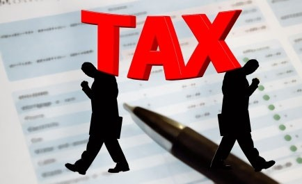

# BUỔI 11: ỨNG DỤNG AI TRONG KẾ TOÁN THUẾ & TUÂN THỦ PHÁP LUẬT

## Năng lực đạt được sau buổi học
- **Hiểu và ứng dụng AI:** Trong các quy trình kê khai thuế (GTGT, TNCN) và tự động hóa tính toán thuế.
- **Phân tích văn bản pháp luật:** Vận dụng AI để đọc hiểu, tóm tắt các thông tư, nghị định phức tạp về thuế (ví dụ: Thông tư 200, Luật Quản lý Thuế).
- **Quản lý rủi ro:** Sử dụng AI để nhận diện, đánh giá và kiểm soát các rủi ro pháp lý và rủi ro thuế từ các giao dịch.
- **Trách nhiệm nghề nghiệp:** Nắm bắt được giới hạn pháp lý và trách nhiệm đạo đức nghề nghiệp khi sử dụng AI.

## Nội dung chương trình
1. Tổng quan Kế toán Thuế trong Kỷ nguyên số
2. Tối ưu hóa Lập kế hoạch Thuế với AI (AI-Based Tax Planning)
3. Ứng dụng AI Hỗ trợ Kê khai & Tuân thủ Thuế
4. Phát hiện Gian lận & Quản trị Rủi ro Thuế
5. Ứng dụng AI với Luật Quản lý Thuế & Thông tư 200
6. Giới hạn Pháp lý & Đạo đức Nghề nghiệp
7. Tổng kết & Thảo luận

---

# PHẦN 1: TỔNG QUAN KẾ TOÁN THUẾ TRONG KỶ NGUYÊN SỐ

## 1.1 Khái quát về Kế toán Thuế hiện đại
- Kế toán thuế là một quy trình đòi hỏi sự chính xác tuyệt đối và cập nhật liên tục.
- Hệ thống văn bản pháp luật thuế thường xuyên thay đổi và phức tạp.
- Các doanh nghiệp đối mặt với áp lực lớn về thời hạn nộp báo cáo và nghĩa vụ thuế.

## 1.2 Thách thức của Kế toán Thuế truyền thống
- Khối lượng dữ liệu chứng từ (hóa đơn, biên lai) cần xử lý thủ công khổng lồ.
- Dễ xảy ra sai sót con người trong quá trình nhập liệu và đối chiếu.
- Tốn nhiều thời gian tra cứu và áp dụng các thông tư, nghị định mới.

## 1.3 Sự can thiệp của Trí tuệ Nhân tạo (AI)
- AI mang đến giải pháp **tự động hóa** các quy trình thủ công.
- Cung cấp khả năng **phân tích dữ liệu lớn** (Big Data) để tìm ra các rủi ro tiềm ẩn.
- Chuyển dịch vai trò của kế toán viên từ "người nhập liệu" sang "nhà tư vấn chiến lược thuế".

## 1.4 Lợi ích cốt lõi khi áp dụng AI
- **Tiết kiệm thời gian:** Giảm đến 80% thời gian cho các công việc lặp đi lặp lại.
- **Tăng tính chính xác:** Loại bỏ rủi ro sai sót do yếu tố con người.
- **Đảm bảo tuân thủ:** AI tự động cập nhật và cảnh báo các thay đổi từ luật thuế.

---

# PHẦN 2: TỐI ƯU HÓA LẬP KẾ HOẠCH THUẾ VỚI AI

## 2.1 Lập kế hoạch thuế là gì?
- Là quá trình phân tích chiến lược tài chính nhằm tối thiểu hóa nghĩa vụ thuế.
- Vẫn phải đảm bảo tuân thủ nghiêm ngặt các quy định pháp luật.
- Mục tiêu là tối đa hóa lợi ích kinh tế cho doanh nghiệp (Tax Planning Optimization).

## 2.2 AI trong Tối ưu hóa Lập kế hoạch Thuế
- AI phân tích dữ liệu tài chính, các quy định thuế và mục tiêu kinh doanh.
- Đề xuất các phương án lập kế hoạch thuế để tối đa hóa lợi ích.
- Xem xét đa chiều các yếu tố: khoản giảm trừ (deductions), tín dụng thuế (credits) và các trường hợp miễn giảm (exemptions).

## 2.3 Phân tích kịch bản Thuế (Scenario Analysis)
- AI có khả năng tạo ra nhiều kịch bản (Tốt/Xấu/Cơ sở) cho quyết định kinh doanh.
- Dự báo dòng tiền thuế phải nộp trong tương lai dựa trên dữ liệu lịch sử.
- Giúp Ban giám đốc lựa chọn phương án có mức rủi ro và chi phí thuế thấp nhất.

## 2.4 Cập nhật Thông tin Thuế theo thời gian thực (Real-time Tax Insights)
- AI liên tục theo dõi các thay đổi trong luật thuế, quy định và yêu cầu của từng ngành.
- Phân tích khối lượng lớn dữ liệu liên quan đến thuế để phát ra cảnh báo tức thì.
- Đảm bảo chiến lược thuế luôn được cập nhật và phù hợp với các quy định mới nhất.

## 2.5 Tính toán Thuế Tự động (Automated Tax Calculations)
- Hệ thống AI phân tích dữ liệu tài chính, nhận diện các giao dịch chịu thuế.
- Tự động áp dụng các mức thuế suất và quy tắc tính thuế tương ứng.
- **Hình minh họa tính toán thuế:**

## 2.6 Ưu điểm của Tính toán Tự động
- Giảm thiểu rủi ro sai sót (human error).
- Đảm bảo tính chính xác cao trong quá trình tính thuế.
- Giải phóng thời gian quý báu của kế toán viên cho các nhiệm vụ mang tính chiến lược hơn.

---

# PHẦN 3: ỨNG DỤNG AI HỖ TRỢ KÊ KHAI & TUÂN THỦ THUẾ

## 3.1 Tuân thủ Thuế Tự động (Automated Tax Compliance)
- AI hỗ trợ chuẩn bị và nộp các tờ khai thuế hoàn toàn tự động.
- Tích hợp trực tiếp với phần mềm kế toán để trích xuất dữ liệu tài chính liên quan.
- Tự động tạo các mẫu biểu thuế chính xác theo chuẩn mực của cơ quan thuế.

## 3.2 Lợi ích của Kê khai Tự động
- Giảm rủi ro điền sai thông tin trên tờ khai.
- Đảm bảo tuân thủ đúng thời hạn, tránh các khoản phạt nộp chậm.
- Tối ưu hóa nguồn lực nhân sự của phòng kế toán.

## 3.3 Quản lý Tài liệu Thuế (Tax Document Management)
- AI đơn giản hóa việc quản lý tài liệu thông qua số hóa và tổ chức hồ sơ.
- Sử dụng công nghệ Nhận dạng Ký tự Quang học (OCR) để đọc dữ liệu.
- Tự động trích xuất thông tin từ hóa đơn, biên lai và báo cáo tài chính.

## 3.4 Khả năng truy xuất và tìm kiếm tài liệu
- Việc tìm kiếm một chứng từ cũ phục vụ thanh tra thuế diễn ra trong vài giây.
- Hệ thống AI gắn thẻ (tagging) tự động dựa trên nội dung chứng từ.
- Đảm bảo tính toàn vẹn và an toàn của kho lưu trữ số.

## 3.5 AI trong kê khai Thuế GTGT và TNCN
- **Thuế GTGT:** Tự động đối chiếu hóa đơn đầu vào - đầu ra, loại bỏ hóa đơn không hợp lệ.
- **Thuế TNCN:** Tự động tập hợp thu nhập từ nhiều nguồn, tính toán mức giảm trừ gia cảnh.
- Gợi ý mức đóng thuế tối ưu cho người lao động và doanh nghiệp.

## 3.6 So sánh: Kế toán truyền thống vs. Kế toán AI
- **Truyền thống:** Xử lý hàng ngàn hóa đơn thủ công cuối tháng, dễ sót hóa đơn.
- **AI:** Hóa đơn được xử lý ngay khi phát sinh, tự động kiểm tra tính hợp lệ qua kết nối API.

---

# PHẦN 4: PHÁT HIỆN GIAN LẬN & QUẢN TRỊ RỦI RO THUẾ

## 4.1 Đánh giá và Giảm thiểu Rủi ro (Risk Assessment)
- AI hỗ trợ nhận diện các rủi ro thuế tiềm ẩn.
- Giảm thiểu khả năng doanh nghiệp rơi vào tình trạng không tuân thủ.
- Phân tích sâu các mẫu giao dịch và yêu cầu pháp lý để cắm cờ (flag) cảnh báo.

## 4.2 Tính chủ động trong Quản trị Rủi ro
- Hệ thống không đợi đến lúc quyết toán mới báo lỗi.
- Đề xuất các chiến lược giảm thiểu rủi ro ngay khi giao dịch vừa được ghi nhận.
- Tránh được các khoản phạt nặng nề hoặc bị thanh tra đột xuất.

## 4.3 Phát hiện Gian lận Thuế (Tax Fraud Detection)
- AI phân tích dữ liệu tài chính để nhận diện những bất thường (anomalies).
- So sánh các giao dịch hiện tại với dữ liệu lịch sử và mô hình hành vi.
- Cảnh báo các hành vi có dấu hiệu thao túng, chuyển giá hoặc trốn thuế.

## 4.4 Tầm quan trọng của Phát hiện Gian lận sớm
- Ngăn chặn thất thoát tài sản của doanh nghiệp.
- Bảo vệ danh tiếng và uy tín của công ty trên thị trường.
- Đảm bảo tuân thủ tuyệt đối các quy định của cơ quan thuế.

## 4.5 Hỗ trợ Thanh tra Thuế (Audit Support)
- AI tổ chức và truy xuất dữ liệu tài chính một cách hiệu quả nhất.
- Hỗ trợ cung cấp hồ sơ kiểm toán bằng các thuật toán Machine Learning.
- Xác định sự thiếu nhất quán trong sổ sách trước khi cơ quan thuế phát hiện.
- **Hỗ trợ thanh tra:**

## 4.6 Audit Trail (Dấu vết Kiểm toán)
- Mọi chỉnh sửa, thao tác trên chứng từ đều được AI lưu lại.
- Dễ dàng truy vết ai là người thay đổi số liệu và thay đổi vì lý do gì.
- Nâng cao tính minh bạch và sức thuyết phục khi giải trình với cơ quan chức năng.

---

# PHẦN 5: ỨNG DỤNG AI VỚI LUẬT QUẢN LÝ THUẾ & THÔNG TƯ 200

## 5.1 Xử lý văn bản pháp luật bằng AI
- Các thông tư (như Thông tư 200) và văn bản luật rất dài và phức tạp.
- AI (như ChatGPT) có thể "đọc" hàng trăm trang tài liệu trong vài giây.
- Khả năng xử lý ngôn ngữ tự nhiên giúp AI hiểu đúng ngữ cảnh pháp lý.

## 5.2 Kỹ thuật Tóm tắt Văn bản Phức tạp
- Kế toán viên có thể sử dụng các "Prompt" (Câu lệnh) để yêu cầu AI tóm tắt.
- Ví dụ: "Tóm tắt các điều kiện ghi nhận doanh thu theo Thông tư 200".
- Kết quả trả về là các gạch đầu dòng ngắn gọn, dễ hiểu và đi thẳng vào trọng tâm.

## 5.3 Nhận diện rủi ro từ Thông tư 200
- AI có thể so sánh dữ liệu hạch toán thực tế với quy định trong Thông tư 200.
- Phát hiện các bút toán không đúng bản chất theo hướng dẫn của Chế độ kế toán.
- Đảm bảo tính tuân thủ ngay từ khâu ghi sổ (bookkeeping).

## 5.4 Phân tích Điều kiện Khấu trừ Thuế
- Đưa một trường hợp chi phí cụ thể vào AI và hỏi: "Chi phí này có được khấu trừ thuế TNDN không?"
- AI sẽ quét các quy định trong Luật Quản lý Thuế và phản hồi kèm theo trích dẫn.
- Giúp kế toán viên tự tin hơn trong các quyết định hạch toán.

## 5.5 Cập nhật chênh lệch giữa Kế toán và Thuế
- Kế toán tài chính tuân theo Thông tư 200, trong khi Kế toán thuế tuân theo Luật Thuế.
- AI hỗ trợ tự động bóc tách và theo dõi các khoản chênh lệch tạm thời/vĩnh viễn.
- Hỗ trợ lập Bảng kê khai quyết toán thuế TNDN nhanh chóng.

## 5.6 Tính năng "Trợ lý ảo Pháp lý"
- Có thể huấn luyện một Chatbot AI nội bộ chứa dữ liệu là toàn bộ hệ thống Luật Thuế Việt Nam.
- Kế toán viên có thể đặt câu hỏi bằng tiếng Việt thông thường.
- Tiết kiệm chi phí thuê chuyên gia tư vấn luật cho các vấn đề cơ bản.

---

# PHẦN 6: GIỚI HẠN PHÁP LÝ & ĐẠO ĐỨC NGHỀ NGHIỆP

## 6.1 Rủi ro "Ảo giác" (Hallucinations) của AI
- AI tạo sinh (như ChatGPT) có thể tự bịa ra các điều luật không có thật.
- Nguy hiểm nếu kế toán viên áp dụng mù quáng mà không kiểm chứng.
- Luôn phải có bước xác minh (verify) bằng các nguồn tài liệu chính thống.

## 6.2 Bảo mật Dữ liệu Tài chính
- Việc đưa dữ liệu công ty (doanh thu, lợi nhuận, lương) lên các nền tảng AI công cộng có thể gây rò rỉ.
- Các doanh nghiệp cần chính sách bảo mật dữ liệu nghiêm ngặt.
- Ưu tiên sử dụng các hệ thống AI nội bộ (On-premise) hoặc có cam kết bảo mật cấp doanh nghiệp (Enterprise Tier).

## 6.3 Trách nhiệm Giải trình (Accountability)
- Khi AI tính sai thuế, cơ quan thuế sẽ phạt doanh nghiệp, không phải phạt AI.
- Người kế toán viên vẫn là người chịu trách nhiệm cuối cùng (Human-in-the-loop).
- AI chỉ là công cụ hỗ trợ (Copilot), không phải người thay thế hoàn toàn (Autopilot).

## 6.4 Đạo đức Nghề nghiệp Kế toán
- Tuân thủ nguyên tắc khách quan và trung thực.
- Không sử dụng AI để tìm kẽ hở trốn thuế một cách phi pháp.
- Đảm bảo ứng dụng AI nhằm tăng cường tính minh bạch, không phải để che giấu sai phạm.

---

# PHẦN 7: TỔNG KẾT & THẢO LUẬN

## 7.1 Tóm tắt Bài học
- AI mang lại bước tiến lớn trong tối ưu hóa kế hoạch thuế và tuân thủ.
- Tự động hóa tính toán, kê khai và chuẩn bị hồ sơ thanh tra.
- Ứng dụng AI giúp tra cứu, tóm tắt Thông tư 200 và Luật Thuế dễ dàng.
- Luôn đề cao bảo mật dữ liệu và kiểm chứng thông tin từ AI.

## 7.2 Định hướng thực hành (Buổi 11 - Thực hành)
- Học viên sẽ được thực hành:
- Đưa một đoạn Thông tư Thuế phức tạp vào ChatGPT để yêu cầu tóm tắt.
- Sử dụng Prompt liệt kê các điều kiện khấu trừ thuế từ tình huống thực tế.
- Kiểm tra tính đúng đắn và xử lý rủi ro "ảo giác" của AI.

## 7.3 Thảo luận mở
- **Câu hỏi:** "Bạn nghĩ rào cản lớn nhất khi doanh nghiệp Việt Nam áp dụng AI vào Kế toán Thuế là gì?"
- **Q&A:** Giải đáp các thắc mắc của học viên.

## 7.4 Tài liệu Đọc thêm
- *Chapter 9: AI-Based Tax Planning and Compliance (Charnelle Gibson)*
- *Luật Quản lý thuế, Thông tư 200 (Bản Tiếng Việt)*
- *Sổ tay Prompt Kế toán (Scott Dell)*

## CẢM ƠN CÁC BẠN ĐÃ LẮNG NGHE!
- Chúc các bạn ứng dụng thành công AI vào Kế toán Thuế!
