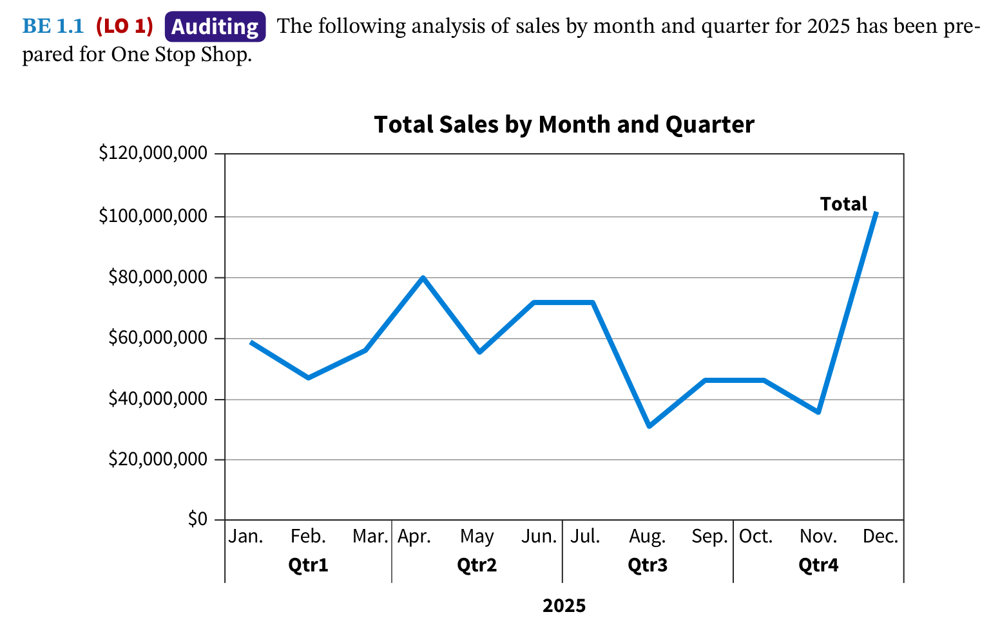

# Chapter 1: Data and Analytics in the Accounting Profession

<!-- tabs:start -->
#### **Tiếng Việt**

# Chương 1: Dữ liệu và Phân tích trong Nghề Kế toán (Data and Analytics in the Accounting Profession)

## Tổng quan Chương (Chapter Preview)

### Tài nguyên Dữ liệu Thực hành
Trong chương này, bạn sẽ sử dụng bộ dữ liệu sau cho bài tập thực hành. Bạn có thể tải về để mở ra xem trước dữ liệu:
- 📥 **[LittleTots_Financials.csv](../TaiLieu/Datasets/LittleTots_Financials.csv)**: Bảng cân đối số phát sinh và dữ liệu tài chính cơ bản cho Cơ sở Trông trẻ Little Tots.
Những thay đổi về dữ liệu và công nghệ đang tác động đến vai trò của kế toán viên trong mọi lĩnh vực kế toán (Accounting). Các kế toán viên của tương lai phải là những chuyên gia linh hoạt, sáng tạo, am hiểu về dữ liệu và công nghệ (Data and Technology Literate). Họ sẽ là những người giải quyết vấn đề (Problem-solvers) có tư duy phản biện (Critical Thinking), có khả năng sử dụng công nghệ và dữ liệu để thúc đẩy sự hiểu biết và thay đổi trong kinh doanh. Họ cần phải "suy nghĩ vượt ra ngoài khuôn khổ" (Think outside the box) để tạo ra giá trị bằng cách sử dụng dữ liệu và các phép phân tích (Analyses). Chương này là một bản tổng quan về cách những thay đổi này đang diễn ra, các loại dữ liệu và phân tích mà những sinh viên mới tốt nghiệp có khả năng gặp phải, và những kỹ năng họ cần để thành công trong môi trường đang thay đổi này.

### Góc nhìn Chuyên gia (Professional Insight): Tại sao Phân tích Dữ liệu (Data Analytics) lại quan trọng cho sự nghiệp của bạn?
Chương này xem xét trước về dữ liệu và phân tích trong nghề kế toán và các kỹ năng liên quan cần thiết cho sự nghiệp kế toán tương lai của bạn. Một số trích dẫn từ các nhà lãnh đạo tại hai trong số các công ty kế toán lớn nhất thế giới đặt tầm quan trọng của những kỹ năng này vào một bức tranh toàn cảnh.

**Roger O’Donnell, Giám đốc Toàn cầu về Dữ liệu và Phân tích, bộ phận kiểm toán của KPMG:**
Công nghệ không thay thế kế toán viên; thay vào đó, nó đang tăng cường sự thành thạo kỹ thuật của họ cũng như các kỹ năng tư duy phản biện và giải quyết vấn đề để đưa ra những quyết định sâu sắc hơn, giảm thiểu rủi ro và tăng hiệu quả của việc lập báo cáo tài chính (Financial Statements) và hồ sơ khai thuế (Tax Filings)... Nhưng có một nhu cầu ngày càng tăng đối với sinh viên kế toán trong việc học cách khai thác và phân tích dữ liệu tài chính và kế toán, vì nó có thể nâng cao đáng kể khả năng của họ.

**Patty Pogemiller, Giám đốc Điều hành Khối Trải nghiệm Nhân tài Toàn cầu của Deloitte:**
Kỹ năng giải quyết vấn đề là thiết yếu trong một ngành kinh doanh dịch vụ khách hàng như dịch vụ chuyên môn. Các nhà tuyển dụng đang tìm kiếm những người thể hiện khả năng suy nghĩ phân tích (Think analytically) và tiếp cận một vấn đề theo cách có cấu trúc và có phương pháp. Liệu họ có thể phân tích và giải quyết một vấn đề một cách khách quan không? Và một khi họ có giải pháp, họ phải có khả năng truyền đạt nó cho người khác - khách hàng, quản lý và các thành viên trong nhóm của họ.

---

## Bản đồ Chương (Chapter Roadmap)

**MỤC TIÊU HỌC TẬP (LEARNING OBJECTIVES)** | **CHỦ ĐỀ (TOPICS)** | **ÁP DỤNG (APPLY IT)**
--- | --- | ---
**LO 1.1** Tóm tắt cách những tiến bộ về dữ liệu và công nghệ đang tác động đến các chuyên gia kế toán. | • Dữ liệu và Công nghệ (Data and Technology) • Phân tích và Thực hành Chuyên môn Kế toán (Analytics and Accounting Professional Practice) | Ghép nối Phân tích Dữ liệu với các Lĩnh vực Kế toán
**LO 1.2** Mô tả các giai đoạn của quy trình phân tích dữ liệu (Data Analysis Process). | • Giai đoạn 1: Lên kế hoạch (Plan) • Giai đoạn 2: Phân tích (Analyze) • Giai đoạn 3: Báo cáo (Report) • MOSAIC: Kết hợp tất cả lại với nhau | Giải thích Quy trình Phân tích Dữ liệu cho một Đánh giá Rủi ro Gian lận (Ví dụ: Kiểm toán - Auditing)
**LO 1.3** Xác định các kỹ năng cần thiết để thực hiện phân tích dữ liệu. | • Tư duy Phản biện (Critical Thinking) • Hiểu biết về Dữ liệu (Data Literacy) • Kỹ năng Công nghệ (Technology Skills) • Kỹ năng Giao tiếp (Communication Skills) | Đánh giá Mối quan hệ giữa Kỹ năng và Nhiệm vụ (Ví dụ: Kế toán Thuế - Tax Accounting)
**LO 1.4** Giải thích cách áp dụng tư duy phân tích dữ liệu (Data Analytics Mindset) vào quy trình phân tích dữ liệu. | • Hiểu rõ các Bên liên quan (Understand the Stakeholders) • Xác định Mục đích (Identify the Purpose) • Xem xét các Giải pháp thay thế (Consider Alternatives) • Đánh giá Rủi ro (Assess Risks) • Xác định Kiến thức (Identify Knowledge) • Thực hiện Tự phản ánh (Perform Self-Reflection) • SPARKS: Bộ công cụ Tư duy Phản biện | Tích hợp Tư duy Phản biện với Quy trình Phân tích Dữ liệu (Ví dụ: Kiểm toán)

---

## 1.1 Dữ liệu và Phân tích đang Chuyển đổi Nghề Kế toán như thế nào? (How are Data and Analytics Transforming the Accounting Profession?)

> **MỤC TIÊU HỌC TẬP 1 (LEARNING OBJECTIVE 1)**
> Tóm tắt cách những tiến bộ về dữ liệu và công nghệ đang tác động đến các chuyên gia kế toán.

Đây là một thời điểm thú vị để bước chân vào nghề kế toán! Công nghệ mới, thân thiện với người dùng cho phép các kế toán viên hoàn thành các chức năng kế toán, chẳng hạn như tạo các bút toán nhật ký (Journal Entries) và lập báo cáo tài chính (Financial Statements) cũng như các báo cáo khác, trong một khoảng thời gian chỉ bằng một phần nhỏ so với trước đây. Bởi vì các chức năng kế toán lặp đi lặp lại này có thể được tự động hóa, kế toán viên có thể tập trung vào các hoạt động mang lại giá trị gia tăng (Value-added Activities) cho tổ chức của họ, chẳng hạn như đánh giá các kiểm soát (Evaluating Controls), cung cấp thông tin chi tiết về tài chính (Financial Insights), và thực hiện các phân tích để hỗ trợ việc ra quyết định kinh doanh (Business Decision-making).

Sự tiến hóa này của nghề kế toán cũng được phản ánh trong các kỳ thi lấy chứng chỉ chuyên môn bắt buộc để hành nghề trong lĩnh vực này:
- Các kỳ thi Kế toán viên Công chứng (CPA - Certified Public Accountant) và Kế toán Quản trị Công chứng (CMA - Certified Management Accountant) hiện nay đều bao gồm chủ đề phân tích dữ liệu (Data Analytics).
- Bắt đầu từ năm 2020, Viện Kế toán Quản trị (IMA - Institute of Management Accountants) đã thêm phần "Công nghệ và Phân tích" (Technology and Analytics) vào kỳ thi CMA. IMA cho biết những thay đổi này được thực hiện để "làm cho kỳ thi trở nên phù hợp hơn với thị trường việc làm hiện tại."
- Viện Kế toán viên Công chứng Hoa Kỳ (AICPA), trong một nỗ lực chung với Hiệp hội Quốc gia các Hội đồng Kế toán Bang (NASBA), đã ra mắt chương trình CPA Evolution vào năm 2021. CPA Evolution là một sự thay đổi trong mô hình cấp phép CPA nhằm "công nhận các kỹ năng và năng lực thay đổi nhanh chóng mà việc hành nghề kế toán đòi hỏi ngày nay và sẽ đòi hỏi trong tương lai." Trong khi kỳ thi CPA hiện tại đã bao gồm phân tích dữ liệu, định dạng kỳ thi mới (sẽ được triển khai vào năm 2024) sẽ bao gồm nhiều công nghệ và phân tích dữ liệu hơn ở cả hai phần thi cốt lõi (Core) và chuyên ngành (Discipline).

### Dữ liệu và Công nghệ (Data and Technology)
Như những thay đổi đối với các kỳ thi chuyên môn kế toán cho thấy, dữ liệu, phân tích và công nghệ đang thay đổi nghề kế toán. Nhưng dữ liệu và phân tích là gì? Lưu ý sự tách biệt của các từ "dữ liệu" (Data) và "phân tích" (Analytics). Mặc dù nó thường được gọi đơn giản là "phân tích dữ liệu", mỗi cái là một yếu tố riêng biệt - và điều quan trọng là phải suy nghĩ về chúng một cách tách biệt. Việc thực hiện phân tích dữ liệu bao gồm xác định cả dữ liệu cần thiết cho việc phân tích và phương pháp phân tích (Analysis Method) phù hợp.

**Dữ liệu (Data)** là những con số và sự kiện thô. Công nghệ giúp chuyển đổi dữ liệu đó thành **thông tin (Information)**, đó là kiến thức thu được từ dữ liệu. Ví dụ, dữ liệu giao dịch bán hàng (Sales Transaction Data) sẽ bao gồm ngày bán, sản phẩm được mua, số lượng bán và giá cho mỗi lần bán. Chúng ta có thể lấy được thông tin chẳng hạn như tổng doanh số theo sản phẩm bằng cách tóm tắt dữ liệu (nhân số lượng bán với giá) theo sản phẩm. **Phân tích dữ liệu (Data Analytics)** là quá trình phân tích dữ liệu thô để trả lời các câu hỏi hoặc cung cấp những hiểu biết sâu sắc (Insights).

Sự xuất hiện của phần mềm **Kinh doanh Thông minh Tự phục vụ (SSBI - Self-Service Business Intelligence)** đã thúc đẩy việc gia tăng sử dụng dữ liệu và phân tích. SSBI hiện nay đã có sẵn và có thể truy cập được bởi tất cả người dùng doanh nghiệp. Có hai tính năng chính của phần mềm SSBI:
- Nó cung cấp khả năng xử lý dữ liệu mở rộng để chuẩn bị dữ liệu (Preparing Data), phân tích dữ liệu (Analyzing Data) và báo cáo kết quả phân tích dữ liệu (Reporting Data Analysis Results).
- Nó dễ sử dụng. Không yêu cầu phải có bằng cấp về khoa học máy tính!

Có một số công cụ SSBI xuất sắc hiện có sẵn, bao gồm Alteryx, Microsoft Excel, Power BI và Tableau. Các công cụ này cho phép mọi doanh nghiệp thành công trong môi trường dữ liệu mới. ILLUSTRATION 1.1 là một ví dụ về phần mềm SSBI Alteryx. Alteryx cho phép người dùng nhanh chóng thiết kế các luồng công việc (Workflows) để truy cập, thao tác, phân tích và xuất dữ liệu. Giống như tất cả các phần mềm SSBI, giao diện của nó rất thân thiện với người dùng và không yêu cầu phải không cần biết cách lập trình.

Quy trình làm việc trong ILLUSTRATION 1.1 thực hiện nhập (Imports), làm sạch (Cleans), lọc (Filters) và xuất (Exports) kết quả. Trong ví dụ này, người dùng muốn thực hiện một phân tích về các giao dịch tại Hoa Kỳ (U.S. Transactions) của một công ty. Luồng công việc bắt đầu bằng việc nhập một bảng tính Excel chứa tất cả các giao dịch. Tiếp theo, dữ liệu được làm sạch để loại bỏ các giá trị rỗng (Null Values) và các khoảng trắng ở đầu và cuối (Leading and Trailing Spaces). Giá trị rỗng cho biết một giá trị không xác định hoặc bị thiếu. (Sau này trong khóa học, bạn sẽ học về tầm quan trọng của việc làm sạch dữ liệu trước khi phân tích). Khi dữ liệu đã được làm sạch, chúng được lọc để tách các giao dịch được thực hiện tại Hoa Kỳ khỏi các giao dịch được thực hiện ở các quốc gia khác. ILLUSTRATION 1.2 cho thấy mất bao lâu (thời gian chạy - Run Time) để phần mềm hoàn thành luồng công việc này.

Nó chỉ mất 0.5 giây để nhập, làm sạch, lọc và xuất hơn 2.000 hàng dữ liệu. Phần mềm như Alteryx có thể tiết kiệm cho kế toán viên vô số giờ đồng hồ cho những công việc tẻ nhạt.
Sự sẵn có ngày càng tăng của dữ liệu, các kỹ thuật và công cụ được sử dụng để tạo ra giá trị từ chúng, và sự dễ dàng khi sử dụng những công cụ này đã tác động đến cách các kế toán viên, từ kiểm toán viên (Auditors) đến kế toán tài chính (Financial Accountants), thực hiện công việc của họ mỗi ngày.

### Phân tích và Thực hành Chuyên môn Kế toán (Analytics and Accounting Professional Practice)
Sử dụng các công cụ Kinh doanh Thông minh Tự phục vụ (SSBI) đã trao quyền cho các kế toán viên trong các lĩnh vực thực hành khác nhau để sử dụng dữ liệu và phân tích nhằm cung cấp các dịch vụ giá trị gia tăng cho khách hàng và người sử dụng lao động của họ.

#### Kiểm toán (Auditing)
Việc sử dụng phân tích trong nghề kiểm toán đang phát triển:
- Các cuộc kiểm toán đã mở rộng vượt ra ngoài việc thử nghiệm dựa trên mẫu (Sample-based Testing) để bao gồm các phân tích trên toàn bộ quần thể dữ liệu liên quan đến kiểm toán (Entire Populations of Audit-relevant Data).
- Kiểm toán viên có thể xem xét toàn bộ các tập dữ liệu để xác định tất cả các ngoại lệ (Exceptions), sự bất thường (Anomalies), và các điểm dữ liệu dị biệt (Outliers).
- Các cuộc kiểm toán dựa trên dữ liệu (Data-driven Audits) làm giảm thời gian khách hàng phải dành ra để thu thập thông tin cho kiểm toán viên và cho phép có nhiều thời gian hơn cho việc phân tích, biến quá trình kiểm toán thành một trải nghiệm tốt hơn cho tất cả những người liên quan.

Cả kiểm toán viên nội bộ (Internal Auditors) và kiểm toán viên độc lập (External Auditors) đều sử dụng phân tích để thực hiện đánh giá rủi ro (Risk Assessment) và các thủ tục cơ bản (Substantive Procedures). ILLUSTRATION 1.3 là một ví dụ về cách phân tích được sử dụng để thực hiện đánh giá rủi ro bằng cách hiển thị sự gia tăng hoặc giảm sút trong từng tài khoản sổ cái chung (General Ledger Account) cho năm hiện tại và năm trước. Lưu ý rằng hình ảnh minh họa này bao gồm cả số tiền của năm trước bằng cách hiển thị chúng trong một khung viền đen. Các thanh màu xanh lá cây đại diện cho số tiền năm hiện tại nhỏ hơn 3 triệu đô la. Các thanh màu cam đại diện cho số tiền năm hiện tại lớn hơn 3 triệu đô la và cần được điều tra thêm. Loại phân tích này giúp kiểm toán viên nhanh chóng xác định các tài khoản có vẻ như có rủi ro sai sót (Risk of Misstatement) cao hơn, để họ có thể tiến hành điều tra thêm.

Ngoài đánh giá rủi ro, kiểm toán viên có thể sử dụng phân tích dữ liệu để thực hiện các thủ tục phân tích cơ bản (Substantive Analytical Procedures) hỗ trợ cho cơ sở dẫn liệu (Assertion) rằng các sổ sách tài chính của một thực thể là đầy đủ (Complete), hợp lệ (Valid), và chính xác (Accurate). ILLUSTRATION 1.4 là một ví dụ về điều này sử dụng trực quan hóa dữ liệu (Data Visualization), tức là sự trình bày bằng hình ảnh của thông tin và dữ liệu.

Ví dụ trong ILLUSTRATION 1.4 đã sử dụng trực quan hóa dữ liệu (Data Visualization) để so sánh doanh thu kỳ vọng và thực tế nhằm xác định xem có tháng nào cần phân tích thêm hay không. Nó cho thấy doanh thu thực tế cao hơn dự kiến vào tháng Hai, tháng Bảy và tháng Mười Hai, do đó kiểm toán viên có thể quyết định tập trung vào ba tháng đó để kiểm tra bổ sung.

Các thủ tục kiểm toán cũng đang thay đổi. Do nhiều công ty đang đầu tư vào phần mềm Tự động hóa Quy trình bằng Robot (RPA - Robotic Process Automation) và phần mềm tự động hóa phân tích để tự động hóa các tác vụ kiểm toán thủ công, các kiểm toán viên có thể tập trung vào việc phân tích và cung cấp những hiểu biết sâu sắc có giá trị.

#### Kế toán Tài chính (Financial Accounting)
Vai trò của các kế toán tài chính cũng đang dịch chuyển. Tương tự như trong kiểm toán, những thay đổi này liên quan đến cả phần mềm tự động hóa (RPA và phần mềm tự động hóa phân tích) và phần mềm Kinh doanh Thông minh Tự phục vụ (SSBI). Việc sử dụng phần mềm tự động hóa để thực hiện các chức năng kế toán tài chính thường xuyên như ghi chép các bút toán nhật ký, lập bảng cân đối số phát sinh (Trial Balances), thực hiện phân tích tài khoản sơ bộ, và lập báo cáo tài chính giúp các kế toán viên có thêm thời gian để phân tích dữ liệu nhằm tìm ra những thông tin sâu sắc.

Phần mềm SSBI cho phép các kế toán tài chính thực hiện phân tích và tạo các bảng điều khiển tài chính (Financial Dashboards) để hỗ trợ việc ra quyết định. Bảng điều khiển (Dashboard) là một giao diện người dùng đồ họa hiển thị các chỉ số hiệu suất chính (Key Performance Indicators) cho một tổ chức. ILLUSTRATION 1.5 là một ví dụ về các loại thông tin sâu sắc mà kế toán tài chính có thể tìm thấy khi sử dụng dữ liệu – trong trường hợp này là một bảng điều khiển có thể giám sát hiệu suất tài chính.

Bảng điều khiển này kết hợp các phân tích về những yếu tố khác nhau của các báo cáo tài chính. Người dùng có thể nhanh chóng nhìn thấy các chỉ số hiệu suất chính (KPI) cung cấp cái nhìn sâu sắc về hiệu suất kinh doanh tổng thể:
- Thông tin bảng điều khiển có thể được xem theo năm, quý hoặc tháng bằng cách sử dụng các tab ở trên cùng.
- Hàng trên cùng là một bức tranh toàn cảnh về cách doanh thu, chi phí, nợ phải trả, tài sản, lợi nhuận gộp và tiền mặt so sánh với các mục tiêu (Goals) như thế nào.
- Các hình ảnh trực quan trong bảng điều khiển cung cấp một bản phân tích về doanh thu và chi phí, tổng tài sản và tổng nợ phải trả, và một hình ảnh trực quan cho phép người dùng chọn một tài khoản để xem xét so sánh với năm trước.
- Cuối cùng, bảng ở góc trên bên trái của bảng điều khiển hiển thị các chi phí lớn nhất mà công ty đã phát sinh.

Thường xuyên được sử dụng trong kinh doanh, bảng điều khiển là một công cụ hữu ích để truyền đạt thông tin quan trọng cho tất cả những người cần nó.

#### Kế toán Quản trị (Managerial Accounting)
Trong khi kế toán tài chính phân tích các báo cáo tài chính để báo cáo ra bên ngoài, kế toán quản trị giải quyết các vấn đề báo cáo nội bộ và phân tích hiệu suất (Performance Analysis). Với phần mềm SSBI, kế toán quản trị có thể dễ dàng sử dụng dữ liệu để giúp xác định và quản lý rủi ro, cải thiện lập ngân sách (Budgeting) và dự báo (Forecasting) (bằng cách sử dụng nhiều dữ liệu hơn), và tự động hóa báo cáo nội bộ. Phần mềm SSBI cũng có thể giúp xác định những cải thiện trong vận hành và tạo các bảng điều khiển về các chỉ số hiệu suất chính (KPI).

ILLUSTRATION 1.6 là một bảng điều khiển cung cấp phân tích về doanh số bán sản phẩm và lợi nhuận cho một công ty cung cấp đồ dùng văn phòng:
- Hình ảnh trực quan trên cùng trong bảng điều khiển được gọi là bảng tô sáng (Highlight Table). Các màu sắc nằm trên thang từ nhạt đến đậm. Màu đậm hơn biểu thị doanh số bán hàng cao hơn và màu nhạt hơn biểu thị doanh số bán hàng thấp hơn. Người dùng có thể nhanh chóng xác định các sản phẩm có hiệu suất cao và hiệu suất thấp. Ví dụ, màu đậm nhất là doanh số công nghệ vào năm 2021 trong tháng Mười Một.
- Hình ảnh trực quan dưới cùng trong bảng điều khiển cung cấp cả thông tin về doanh số và tỷ suất lợi nhuận (Profit Margin) theo sản phẩm và danh mục phụ. Các chấm màu đại diện cho các lần bán hàng riêng lẻ cho khách hàng theo tổng số tiền. Màu của các chấm chỉ ra tỷ lệ lợi nhuận (Profit Ratio) trên mỗi lần bán. Thang màu của tỷ lệ lợi nhuận dao động từ âm 50 phần trăm (đỏ đậm) đến tỷ lệ lợi nhuận dương lên đến 50 phần trăm (đen đậm).

Bảng điều khiển sản phẩm này cung cấp cho ban quản lý các bản cập nhật thời gian thực về thông tin doanh số và lợi nhuận, cho phép ban quản lý nhanh chóng xác định và phản hồi đối với các vấn đề có thể xảy ra. Ví dụ, những khách hàng có tỷ lệ lợi nhuận âm có thể được điều tra ngay lập tức.

#### Kế toán Thuế (Tax Accounting)
Phân tích dữ liệu cũng có thể được sử dụng để phân tích tính hiệu quả về thuế (Tax Efficiency) của các đơn vị kinh doanh, xác định các cơ hội thuế, và hỗ trợ đánh giá các cơ hội toàn cầu:
- Phân tích dữ liệu được sử dụng để hỗ trợ tuân thủ thuế (Tax Compliance).
- Tự động hóa việc thu thập dữ liệu để tuân thủ thuế có thể giúp tăng tốc quy trình, để lại cho kế toán thuế nhiều thời gian hơn cho việc phân tích và lập kế hoạch thuế.
- Các bảng điều khiển thuế có thể giúp các tổ chức giám sát các vị thế thuế trong thời gian thực.

ILLUSTRATION 1.7 là một bảng điều khiển thuế sử dụng trực quan hóa dữ liệu để hiển thị động thông tin thuế tiểu bang, nhằm giúp các chuyên gia thuế theo dõi vị thế thuế của tổ chức. Các menu ở trên cùng bên trái cho phép người dùng tương tác với dữ liệu để đi sâu (Drill Down) vào các chi tiết hỗ trợ. Người dùng có thể chọn thực thể công ty (Corporate Entity), loại thuế, khu vực tài phán (tiểu bang), và số lượng thực thể cần hiển thị. Hình ảnh trực quan ở trên cùng của bảng điều khiển là một tổng quan về thuế tiền lương (Payroll Taxes) theo từng bang cho thực thể được chọn. Hình ảnh trực quan dưới cùng hiển thị tổng số tiền của thuế tiền lương.

## 1.2 Các giai đoạn của Quy trình Phân tích Dữ liệu là gì? (What are the Stages of the Data Analysis Process?)

> **MỤC TIÊU HỌC TẬP 2 (LEARNING OBJECTIVE 2)**
> Mô tả các giai đoạn của quy trình phân tích dữ liệu.

Bất kể trong lĩnh vực kế toán nào, các kế toán viên đều tuân theo một quy trình phân tích dữ liệu bao gồm ba giai đoạn quan trọng như nhau (ILLUSTRATION 1.8).

Tuân theo một quy trình phân tích dữ liệu giúp đảm bảo rằng các phân tích dữ liệu được thực hiện một cách hiệu quả và có hiệu suất. Có những chương cụ thể dành riêng cho từng giai đoạn, nhưng ở đây chúng ta sử dụng một ví dụ ở mức độ tổng quan để giới thiệu quy trình này.

One Stop Shop (OSS) là một nhà phân phối bán buôn (Wholesale Distributor) cho các cửa hàng tiện lợi. Một nhà phân phối bán buôn mua sản phẩm từ các nhà cung cấp với số lượng lớn và sau đó bán các sản phẩm đó cho các nhà bán lẻ với giá cao hơn một chút, giữ lại phần chênh lệch làm lợi nhuận (Profit). Kể từ những khởi đầu khiêm tốn vào năm 1888 tại San Francisco, California với tư cách là một cửa hàng bách hóa, OSS đã phát triển thành một trong những nhà phân phối hàng tiêu dùng lớn nhất ở Bắc Mỹ. OSS có cùng mục tiêu ngày nay giống như hơn một trăm ba mươi năm trước - cung cấp cho khách hàng những hàng hóa chất lượng và dịch vụ nhanh chóng.

Ngày nay, OSS hoạt động tại Canada, Mexico và Hoa Kỳ. Công ty có 15 khu vực (5 khu vực ở mỗi quốc gia) và 30 trung tâm phân phối. OSS phân phối các sản phẩm thuộc các danh mục sau:
- Thức ăn trẻ em (Baby food)
- Đồ gia dụng (Household)
- Đồ uống (Beverages)
- Thịt (Meat)
- Ngũ cốc (Cereal)
- Văn phòng phẩm (Office supplies)
- Quần áo (Clothes)
- Chăm sóc cá nhân (Personal care)
- Mỹ phẩm (Cosmetics)
- Đồ ăn vặt (Snacks)
- Trái cây (Fruits)
- Rau quả (Vegetables)

Hãy tưởng tượng bạn là một kế toán viên tại OSS và người quản lý của bạn đã yêu cầu bạn sử dụng phân tích dữ liệu để đánh giá hiệu suất. Hãy áp dụng quy trình phân tích dữ liệu vào nhiệm vụ này.

### Giai đoạn 1: Lên kế hoạch (Stage 1: Plan)
Giai đoạn đầu tiên của quy trình phân tích dữ liệu là lập kế hoạch. Điều này bao gồm việc xác định động lực (Motivation) cho việc phân tích, xác định mục tiêu (Objective) và các câu hỏi cần trả lời, và vạch ra một chiến lược (Strategy) để thực hiện phân tích.

#### Hiểu rõ Động lực (Understand Motivation)
Động lực là lý do tại sao phân tích được thực hiện. Nó chính là chữ "tại sao" (why) chúng ta thực hiện phân tích. Chữ "tại sao" đằng sau một dự án có thể thay đổi từ việc tận dụng các cơ hội cho đến giải quyết các vấn đề, và nguồn gốc của nó có thể là bên ngoài hoặc bên nội bộ:
- **Động lực từ bên ngoài (External motivation):** Dự án bắt nguồn từ một yêu cầu hoặc đòi hỏi của một bên khác, chẳng hạn như các bên liên quan bên ngoài (External Stakeholders). Các bên liên quan bên ngoài này có thể là các nhà đầu tư (Investors), chủ nợ (Creditors), đối tác chuỗi cung ứng, cơ quan quản lý ngành hoặc các cơ quan chính phủ. Một ví dụ khác về động lực từ bên ngoài là khi một người nào đó trong tổ chức, nhưng ở một nhóm khác, giao dự án.
- **Động lực từ nội bộ (Internal motivation):** Dự án được thúc đẩy bởi mong muốn phục vụ khách hàng tốt hơn, hiểu rõ hơn về các hiện tượng để có được thông tin kinh doanh thông minh (Business Intelligence), hoặc để thực hiện các trách nhiệm công việc. Các dự án được thúc đẩy từ nội bộ khi lượng thông tin gia tăng thu được được tin là lớn hơn các chi phí tiềm tàng liên quan đến việc thực hiện các phân tích dữ liệu.

ILLUSTRATION 1.9 là một phân tích về doanh số bán hàng và lợi nhuận trong bốn năm qua tại OSS.

Phân tích tiết lộ rằng tổng doanh số và tổng lợi nhuận tăng từ năm 2023 đến 2024, nhưng lại giảm từ năm 2024 đến 2025 với mức 9.4%. OSS lo ngại về sự sụt giảm này, do đó động lực của họ để thực hiện phân tích là muốn hiểu tại sao doanh thu lại giảm từ năm 2024 đến 2025. Loại động lực này được xem là động lực nội bộ. Một khi động lực cho việc phân tích dữ liệu được thiết lập, đây là lúc chuyển từ bức tranh toàn cảnh sang các mục tiêu cụ thể.

#### Xác định Mục tiêu (Determine the Objective)
Mọi dự án phân tích dữ liệu đều bắt đầu bằng việc thiết lập một mục tiêu, đó chính là đích đến của dự án. Một mục tiêu rõ ràng thu hẹp trọng tâm của phân tích, và các câu hỏi cụ thể hướng dẫn phân tích có thể được phát triển dựa trên mục tiêu đó.
Ví dụ, mục tiêu phân tích của OSS là xác định yếu tố nào đang thúc đẩy sự sụt giảm trong doanh số và lợi nhuận. Dựa trên điều đó, bạn có thể phát triển các câu hỏi cụ thể sau:
- Có phải chỉ có một danh mục sản phẩm duy nhất gặp phải sự sụt giảm về doanh số và lợi nhuận?
- Sự sụt giảm có diễn ra ở tất cả các quốc gia và khu vực không?

#### Thiết kế Chiến lược Dữ liệu và Phân tích (Design the Data and Analysis Strategy)
Phát triển một chiến lược cho dự án là bước cuối cùng trong giai đoạn lên kế hoạch. Có hai khía cạnh đối với điều này – xác định dữ liệu cần thiết để trả lời các câu hỏi và quyết định loại hình phân tích nào là phù hợp dựa trên cả dữ liệu và những câu hỏi đó.
Thiết kế chiến lược cho dữ liệu bao gồm việc xác định dữ liệu cụ thể cần thiết và biết cách truy cập nó. Có hai loại dữ liệu:
- **Dữ liệu nội bộ (Internal data):** Được tìm thấy bên trong tổ chức. Điều này bao gồm dữ liệu giao dịch, dữ liệu sổ cái chung, dữ liệu bán hàng, dữ liệu khách hàng, dữ liệu nhà cung cấp, các tài liệu nội bộ, và email nội bộ.
- **Dữ liệu bên ngoài (External data):** Được thu thập từ bên ngoài tổ chức. Các dữ liệu như thế này có thể đến từ mạng xã hội, các trang web, dữ liệu thời tiết, dữ liệu chính phủ, và bản đồ.

Hiểu được nguồn dữ liệu tiềm năng là rất quan trọng. Ví dụ, việc thực hiện phân tích về các khoản phải trả yêu cầu truy cập vào các nguồn dữ liệu nội bộ để lấy dữ liệu sổ cái chung và dữ liệu nhà cung cấp. Nếu một công ty bán đồ uống và mục tiêu phân tích là dự đoán doanh số bán sô-cô-la nóng, thì cả dữ liệu nội bộ (giao dịch) và dữ liệu bên ngoài (dữ liệu thời tiết) sẽ được sử dụng.

Về phần chiến lược phân tích, có bốn loại phương pháp phân tích dữ liệu, mỗi loại sẽ được thảo luận chi tiết trong các chương tương lai. ILLUSTRATION 1.10 cung cấp một số ví dụ ngắn gọn và định nghĩa cho chúng.

Loại phân tích phổ biến nhất và dễ hiểu nhất, **Phân tích mô tả (Descriptive analytics)**, tiết lộ điều gì đang diễn ra ở hiện tại hoặc điều gì đã xảy ra trong quá khứ. Chúng là loại phân tích đầu tiên được thực hiện để giúp hiểu dữ liệu. Tổng (Sum), đếm (Count), trung bình (Average), trung vị (Median), độ lệch chuẩn (Standard Deviation), và tỷ lệ (Proportions) là các ví dụ.

Thay vì chỉ cho chúng ta biết điều gì đã xảy ra, **Phân tích chẩn đoán (Diagnostic analytics)** tiết lộ tại sao một điều gì đó đã xảy ra. Các thông tin thu được từ phân tích mô tả về những gì đã xảy ra cho phép chúng ta đào sâu hơn để hiểu tại sao. Kết quả của những phân tích này cung cấp thông tin cho việc ra quyết định về các hành động trong tương lai. Ví dụ bao gồm việc phát hiện các dị biệt (Anomaly and Outlier Detection), phân tích xu hướng (Trend Analysis), và nhận dạng mẫu (Pattern Recognition).

**Phân tích dự đoán (Predictive analytics)** cũng giúp hiểu và dự đoán điều gì có thể xảy ra trong tương lai. Phân tích dự đoán sử dụng dữ liệu, các thuật toán thống kê, và học máy (Machine Learning) để xác định khả năng xảy ra của các kết quả trong tương lai dựa trên dữ liệu lịch sử. Mục tiêu là sử dụng những gì đã biết về quá khứ để đưa ra đánh giá tốt hơn về những gì có thể xảy ra trong tương lai. Dự báo (Forecasting), phân tích hồi quy (Regression Analysis), và phân tích chuỗi thời gian (Time-series Analysis) là một vài ví dụ.

Cuối cùng, **Phân tích đề xuất (Prescriptive analytics)** giúp xác định lộ trình hành động tốt nhất để đạt được mục tiêu trong một kịch bản nhất định. Những phân tích này vượt xa các phân tích mô tả và dự đoán bằng cách đề xuất một hoặc nhiều quá trình hành động có thể. Phân tích đề xuất bao gồm phân tích tối ưu hóa (Optimization) và phân tích giả định (What-if analyses).

ILLUSTRATION 1.11 tóm tắt giai đoạn lên kế hoạch cho OSS, bao gồm phương pháp phân tích dữ liệu nên được sử dụng để thực hiện các phân tích.

### Giai đoạn 2: Phân tích (Stage 2: Analyze)
Sau khi lập kế hoạch cẩn thận, đã đến lúc bắt đầu phân tích. Giai đoạn này bao gồm chuẩn bị dữ liệu (Data Preparation), xây dựng các mô hình thông tin (Building Information Models), và khám phá dữ liệu (Exploring Data). Từng phần sẽ được đề cập chi tiết ở phần sau của khóa học này, nhưng chúng được mô tả ngắn gọn ở đây và áp dụng cho kịch bản của OSS.

#### Chuẩn bị Dữ liệu (Prepare Data)
Dữ liệu có chất lượng tốt dẫn đến các phân tích có chất lượng tốt, vì vậy chuẩn bị dữ liệu cho việc phân tích là một bước rất quan trọng trong giai đoạn này. Quy trình này thường được gọi là Trích xuất-Chuyển đổi-Tải (ETL - Extract-Transform-Load).
- **Trích xuất (Extracting):** là quy trình truy xuất dữ liệu từ một nguồn. Điều này có thể là tải xuống một tệp Excel hoặc trích xuất dữ liệu từ cơ sở dữ liệu (Database) hoặc kho dữ liệu (Data Warehouse).
- **Chuyển đổi (Transforming):** diễn ra khi dữ liệu được làm sạch, tái cấu trúc và/hoặc tích hợp với dữ liệu khác trước khi sử dụng cho phân tích.
- **Tải (Loading):** là quy trình nhập dữ liệu đã được chuyển đổi vào phần mềm được sử dụng để phân tích. Có nhiều loại phần mềm phân tích có sẵn, bao gồm Excel, Power BI, và Tableau.

Trong ví dụ OSS, công ty đã trích xuất một tệp chứa hàng nghìn giao dịch và một tệp chứa các số hiệu và tên khu vực. Cả hai tệp phải được chuẩn bị cho phân tích. Bước đầu tiên là xác định xem dữ liệu có cần được làm sạch hay không. Quy trình rà soát dữ liệu để tìm ra các vấn đề có thể xảy ra được gọi là lập hồ sơ dữ liệu (Data Profiling). Để xác minh tất cả dữ liệu đã được trích xuất, bạn có thể so sánh số lượng hàng (Row Counts) của dữ liệu đã trích xuất với tổng số hàng đáng lẽ phải có trong dữ liệu.
Để đảm bảo dữ liệu được chuyển đi một cách chính xác, hãy so sánh các số tiền được chuyển với các số tiền đối chiếu kiểm soát (Control Amounts). Dữ liệu của OSS có thể được chuẩn bị như thế này:
- Trích xuất: So sánh dữ liệu với tổng doanh số và con số doanh thu được cung cấp để chắc chắn tất cả các giao dịch đều có mặt ở đó.
- Chuyển đổi: Tích hợp tệp giao dịch với tệp Excel khu vực của OSS để lấy tên khu vực phục vụ cho việc phân tích theo khu vực.
- Tải: Khi đã được làm sạch và chuyển đổi, các tệp có thể được tải vào phần mềm phân tích.

Khi dữ liệu đã được tải, quá trình phân tích có thể bắt đầu bằng việc xây dựng các mô hình thông tin và khám phá dữ liệu.

#### Xây dựng Mô hình Thông tin (Build Information Models)
Lập mô hình thông tin là việc tạo ra thông tin cần thiết cho mục đích phân tích, bắt đầu từ dữ liệu thu thập được. Ví dụ là các tính toán như thu nhập ròng (Net Income), biên lợi nhuận (Profit Margin), tổng tài sản, hoặc thậm chí là điểm hòa vốn (Break-even Point) tính bằng đô la doanh thu.
Hãy xây dựng mô hình thông tin sử dụng ví dụ OSS để chẩn đoán xem có phải một hay nhiều sản phẩm hoặc khu vực đang thúc đẩy sự sụt giảm trong lợi nhuận hay không. Để phân tích lợi nhuận theo sản phẩm và khu vực, sử dụng dữ liệu OSS đã được làm sạch và chuyển đổi:
- Tạo một mô hình tính toán biên lợi nhuận theo sản phẩm và khu vực.
- Tạo một mô hình tính toán tỷ lệ biên lợi nhuận (Profit Margin Ratio).

ILLUSTRATION 1.12 là một phân tích lợi nhuận theo quốc gia.

Nó cho thấy lợi nhuận chỉ đang sụt giảm ở Canada và Mexico. Khám phá sâu hơn có thể xác định các khu vực cụ thể tại Canada và Mexico đang đóng góp vào sự sụt giảm đó.

#### Khám phá Dữ liệu (Explore Data)
Mục tiêu cốt lõi của phân tích dữ liệu là khám phá dữ liệu để xác định các mẫu hình (Patterns), xu hướng (Trends), hoặc các quan sát bất thường (Unusual Observations). Việc khám phá dữ liệu cho phép chúng ta phát hiện, đặt câu hỏi, và điều tra các mối quan hệ dữ liệu để thực thi thành công các mục tiêu phân tích dữ liệu. Tập dữ liệu tổng hợp của OSS và dữ liệu được tạo ra bởi phân tích biên lợi nhuận có thể được khám phá để tìm các mối quan hệ, các mẫu hình, hoặc các thông tin sâu sắc giúp giải thích tại sao lợi nhuận đã giảm từ năm 2024 xuống 2025. Doanh số là động lực chính của lợi nhuận, vì vậy dữ liệu bán hàng cho Canada và Mexico có thể được khám phá để tìm kiếm thông tin sâu sắc. ILLUSTRATION 1.13 là một phân tích doanh số theo quốc gia và khu vực cho Canada và Mexico.

Phân tích này cho thấy có nhiều khu vực ở cả hai quốc gia nơi doanh số đang suy giảm.

### Giai đoạn 3: Báo cáo (Stage 3: Report)
Mục tiêu của giai đoạn này là xác định xem các phân tích có đáp ứng được các mục tiêu của dự án hay không và sau đó chia sẻ kết quả. Giải thích các phân tích và truyền đạt kết quả là một giai đoạn rất quan trọng – một phân tích tuyệt vời nhưng không đáp ứng được mục tiêu của dự án thì cũng vô ích. Hơn nữa, nếu kết quả không được truyền đạt một cách hiệu quả, thì các phân tích và khuyến nghị không thể được đưa ra hành động.

#### Diễn giải Kết quả (Interpret Results)
Diễn giải phân tích dữ liệu là quy trình xem xét các phân tích để chắc chắn rằng chúng hợp lý (Make Sense) dựa trên mục tiêu của dự án và kết quả là hợp lệ (Valid) và đáng tin cậy (Reliable). Hãy tưởng tượng rằng bạn hoặc một người nào đó khác đã chuẩn bị phân tích lợi nhuận cho OSS như được hiển thị trong ILLUSTRATION 1.12. Nhắc lại rằng mục tiêu của OSS là xác định cái gì đang thúc đẩy sự giảm sút lợi nhuận từ 2024 đến 2025. Phân tích này có đáp ứng mục tiêu đó không?
- Đây là một khởi đầu tốt. Hình ảnh trực quan trong ILLUSTRATION 1.12 cho thấy Canada và Mexico có sự sụt giảm về lợi nhuận, trong khi Hoa Kỳ có một sự gia tăng nhỏ về lợi nhuận.
- Tuy nhiên, việc phân tích chưa hoàn thành. Bước tiếp theo là đào sâu hơn vào các sự sụt giảm đó để tìm ra tại sao Canada và Mexico lại có mức suy giảm lớn như vậy.

#### Truyền đạt Kết quả (Communicate Results)
Kết quả của một dự án phân tích dữ liệu có thể được truyền đạt bằng lời nói, bằng hình ảnh, hoặc bằng văn bản. Thông thường, giao tiếp phân tích dữ liệu sẽ bao gồm các trực quan hóa dữ liệu (ILLUSTRATION 1.12 và 1.13). Truyền đạt kết quả cũng có thể bao gồm các bảng điều khiển (ILLUSTRATION 1.14).

Bảng điều khiển trong ILLUSTRATION 1.14 truyền đạt những thay đổi về lợi nhuận tới ban quản lý của OSS:
- Phần trăm thay đổi trong lợi nhuận theo từng quốc gia so với năm trước (2024-2025).
- Tổng lợi nhuận theo quốc gia (2022-2025).
- Lợi nhuận của mỗi quốc gia đã thay đổi như thế nào so với năm trước.
Ban quản lý có thể sử dụng phân tích này để theo dõi lợi nhuận. Ví dụ, dường như lợi nhuận của OSS đã giảm ở tất cả các sản phẩm ngoại trừ ngũ cốc, quần áo, văn phòng phẩm và chăm sóc cá nhân. Giống như các bước khác trong quy trình phân tích dữ liệu, việc truyền đạt kết quả cũng sẽ được thảo luận chi tiết hơn trong khóa học sau.

### MOSAIC: Kết hợp tất cả lại với nhau (Putting it All Together)
Được tạo ra bằng cách sắp xếp các mảnh gạch vụn với nhiều màu sắc khác nhau thành các mẫu hình (Patterns), các bức tranh khảm (Mosaics) là các loại hình nghệ thuật thị giác gợi lên ý nghĩa và cảm xúc. Để dễ dàng ghi nhớ các bước trong quy trình phân tích dữ liệu, hãy tưởng tượng việc sử dụng dữ liệu để tạo ra một bức tranh khảm sẽ kể một câu chuyện. Giống như các nghệ sĩ sử dụng các quy trình sáng tạo và logic để tiết lộ ý nghĩa về thế giới xung quanh họ thông qua nghệ thuật, các kế toán viên sử dụng phân tích dữ liệu để diễn giải ý nghĩa của dữ liệu và tiết lộ những thông tin kinh doanh sâu sắc để giúp các tổ chức đạt được mục tiêu của họ. ILLUSTRATION 1.15 cung cấp một biểu diễn trực quan của quy trình phân tích dữ liệu MOSAIC.

Khóa học này sẽ bao gồm từng khía cạnh của MOSAIC.

## 1.3 Tư duy Phân tích Dữ liệu là gì? (What is a Data Analytics Mindset?)

> **MỤC TIÊU HỌC TẬP 3 (LEARNING OBJECTIVE 3)**
> Xác định các kỹ năng cần thiết để thực hiện phân tích dữ liệu.

Tư duy phân tích dữ liệu (Data Analytics Mindset) là thói quen nghề nghiệp của việc suy nghĩ phản biện (Critically Thinking) xuyên suốt các giai đoạn lên kế hoạch, phân tích và báo cáo kết quả phân tích dữ liệu trước khi đưa ra và truyền đạt một sự lựa chọn hoặc quyết định chuyên môn. Những cá nhân có tư duy phân tích dữ liệu luôn ham học hỏi. Họ luôn hỏi "tại sao" khi diễn giải các kết quả, họ cởi mở với việc học các công nghệ mới, và họ đánh giá lại chính lối tư duy của bản thân. Làm thế nào bạn có thể phát triển tư duy phân tích dữ liệu? Hãy tập trung vào việc phát triển các kỹ năng như tư duy phản biện (Critical Thinking), sự am hiểu dữ liệu (Data Literacy), sự nhạy bén công nghệ (Technological Agility), và kỹ năng giao tiếp (Communication Skills).

Sự thiếu hụt nhân viên có những kỹ năng phân tích dữ liệu này đã dẫn đến nhu cầu ngày càng tăng đối với giáo dục dữ liệu và phân tích trong tất cả các chương trình đào tạo kinh doanh, và hiện có rất nhiều chương trình cấp bằng và chứng chỉ về phân tích dữ liệu. Mặc dù không phải tất cả các chuyên gia kế toán đều cần một bằng cấp hoặc chứng chỉ chuyên sâu, nhưng họ cần phát triển bộ kỹ năng cần thiết để làm việc hiệu quả với dữ liệu.

### Góc nhìn Chuyên gia (Professional Insight): Nhà tuyển dụng đang tìm kiếm kỹ năng gì?
Sau đây là những đoạn trích từ trang web Tuyển dụng của EY (EY Careers webpage):
Rõ ràng là nhiều người trong chúng ta sẽ làm việc với những công nghệ thậm chí chưa được phát minh, giải quyết những vấn đề chưa từng được nhận diện. Vì vậy, trong khi các bộ kỹ năng kỹ thuật đang phát triển nhanh hơn bao giờ hết, nhiều kỹ năng cũng đang trở nên không còn phù hợp hoặc lỗi thời một cách nhanh chóng. Đó là lý do tại sao ngày nay chúng tôi tuyển dụng nhân sự dựa trên tư duy của họ - không chỉ là bộ kỹ năng của họ. Khi bạn gia nhập với chúng tôi, chúng tôi đầu tư vào sự phát triển của bạn, để bạn có thể tiếp tục xây dựng tư duy và bộ kỹ năng công nghệ để phát triển mạnh mẽ.

Tư duy phân tích là gì? Bạn sẽ hiểu được tầm quan trọng của phân tích và dữ liệu đối với nghề nghiệp của mình, với khả năng trích xuất, chuyển đổi và diễn giải các dữ liệu liên quan. Bạn sẽ là một người giải quyết vấn đề bẩm sinh, có khả năng biến các dữ liệu phức tạp thành những thông tin sâu sắc đơn giản và hữu ích. Bạn sẽ cảm thấy thoải mái khi chia sẻ những kết quả này với cả các bên liên quan nội bộ và bên ngoài. Bạn cũng sẽ cam kết đặt ra những câu hỏi tốt hơn để có được dữ liệu phù hợp và hiểu cách sử dụng nó.

Đây là "các kỹ năng kiến thức được ưu tiên" từ một bài đăng tuyển dụng chuyên viên thuế của PwC:
- Đổi mới thông qua các công nghệ mới và hiện có, cùng với việc thử nghiệm các giải pháp số hóa; và,
- Làm việc với các tập dữ liệu lớn, phức tạp để xây dựng các mô hình và tận dụng các công cụ trực quan hóa dữ liệu.

#### Tư duy Phản biện (Critical Thinking)
Tư duy phản biện là lập luận có kỷ luật được sử dụng để điều tra, hiểu và đánh giá một sự kiện, cơ hội hoặc một vấn đề. Lập luận (Reasoning) là quá trình của con người hình thành các kết luận, phán đoán hoặc suy luận từ các sự kiện một cách logic. Các nhà tuyển dụng không chỉ muốn những người có tư duy phản biện, mà các kỳ thi chứng chỉ chuyên môn như kỳ thi CPA và kỳ thi CMA cũng bao gồm các câu hỏi đánh giá kỹ năng tư duy phản biện. Tư duy phản biện là nền tảng của tư duy phân tích dữ liệu và nên được tích hợp xuyên suốt quá trình phân tích dữ liệu. (Tư duy phản biện sẽ được khám phá và áp dụng vào quy trình phân tích dữ liệu ở phần cuối của chương này.)

#### Sự am hiểu Dữ liệu (Data Literacy)
Am hiểu dữ liệu là khả năng hiểu và truyền đạt dữ liệu. Gartner, Inc., một công ty nghiên cứu và tư vấn hàng đầu thế giới, định nghĩa nó chi tiết hơn, cho rằng am hiểu dữ liệu là "khả năng đọc, viết và giao tiếp bằng dữ liệu trong ngữ cảnh, bao gồm sự hiểu biết về các nguồn dữ liệu và cấu trúc, các phương pháp và kỹ thuật phân tích được áp dụng, và khả năng mô tả việc sử dụng các ứng dụng thực tế và giá trị mang lại."

Tại sao sự am hiểu dữ liệu lại quan trọng đến vậy?
- Một nghiên cứu của công ty phần mềm trực quan hóa dữ liệu Qlik và công ty tư vấn Accenture cho thấy 63% nhân viên sử dụng dữ liệu để đưa ra quyết định ít nhất một lần một tuần.
- Xa hơn nữa, một nghiên cứu của công ty tư vấn McKinsey & Company phát hiện ra rằng các công ty nơi nhân viên liên tục sử dụng dữ liệu trong việc ra quyết định có nhiều khả năng báo cáo tăng trưởng doanh thu trên 10% trong ba năm qua.

#### Kỹ năng Công nghệ (Technology Skills)
Cùng với các kỹ năng am hiểu dữ liệu, các kế toán viên phải biết cách sử dụng công nghệ để làm việc với dữ liệu. Một phân tích trên 500 bài đăng tuyển dụng kế toán trình độ mới vào nghề dành cho sinh viên tốt nghiệp cử nhân khoa học kế toán xác nhận rằng những kỹ năng này được các nhà tuyển dụng săn đón rất cao. ILLUSTRATION 1.16 cho thấy một phân tích về các kỹ năng công nghệ được liệt kê trong các bài đăng tuyển dụng của Robert Half tháng 7 năm 2022. Lưu ý rằng hầu hết các bài đăng tuyển dụng đều yêu cầu ứng viên có kỹ năng Excel vững vàng và hơn một nửa số bài đăng đang tìm kiếm kỹ năng ERP và cơ sở dữ liệu.

Chúng tôi đã nhấn mạnh ảnh hưởng của công nghệ đối với nghề kế toán, nhu cầu về kỹ năng công nghệ, và việc công nghệ thay đổi rất nhanh chóng. Nhưng làm thế nào bạn có thể phát triển các kỹ năng công nghệ nếu công nghệ luôn luôn thay đổi?

Nếu sự nhanh nhẹn của trí óc là khả năng suy nghĩ và thấu hiểu một cách nhanh chóng, thì sự nhạy bén công nghệ (Technological Agility) là sự nhận thức về những phát triển công nghệ mới nhất và sẵn sàng thử nghiệm những điều mới. Chúng ta có thể trở nên nhạy bén về công nghệ bằng cách học các công nghệ mới và phát triển các kỹ năng giúp chúng ta làm được điều đó. Trên thực tế, việc cảm thấy thoải mái khi học các công nghệ mới sẽ dẫn đến sự nhạy bén hơn nữa. Tư duy "học cách để học" (Learn to Learn) này là những gì nhà tuyển dụng đang tìm kiếm ở những nhân viên mới.
Mặc dù khả năng học và sử dụng công nghệ mới là quan trọng, thì kiến thức chuyên sâu về các gói phần mềm cụ thể thiết yếu đối với kế toán viên cũng vậy. Microsoft Excel là một ví dụ hoàn hảo về một kỹ năng thiết yếu, mà ILLUSTRATION 1.16 chứng minh là một kỹ năng được mong muốn bởi hầu hết các nhà tuyển dụng.
Cuối cùng, các công cụ thì cũng chỉ là các công cụ. Chúng giúp kế toán viên làm công việc của họ hiệu quả hơn, nhưng chúng không thay thế được đánh giá chuyên môn hay tư duy phản biện, và chúng không thể tự đưa ra các quyết định. Kiến thức sâu rộng về kế toán và kinh doanh mới là điều tạo ra sự khác biệt giữa các kế toán viên và máy móc. Công nghệ chỉ trở thành một phần quan trọng của kiến thức đó.

#### Kỹ năng Giao tiếp (Communication Skills)
Đánh giá kỹ hơn các bài đăng tuyển dụng của Robert Half cho thấy có nhiều kỹ năng được yêu cầu hơn cho các vị trí kế toán cấp độ đầu vào (ILLUSTRATION 1.17). Các kỹ năng tư duy phản biện được đề cập trong 73% các bài đăng, theo sát sau đó là kỹ năng giao tiếp với 66%.

Khả năng giao tiếp là quan trọng đối với mọi khía cạnh trong sự nghiệp kế toán của bạn. Nhớ lại rằng giám đốc điều hành của Deloitte đã phát biểu rằng các nhân viên phải có khả năng truyền đạt các giải pháp cho người khác. Góc nhìn chuyên gia ở phần đầu chương này cũng nhấn mạnh sự cần thiết của các kỹ năng giao tiếp vững vàng. Bài đăng tuyển dụng của EY đề cập đến "chia sẻ các kết quả này với cả các bên liên quan nội bộ và bên ngoài", điều này chỉ ra rõ ràng rằng việc truyền đạt kết quả phân tích dữ liệu là một kỹ năng thiết yếu đối với những sinh viên mới tốt nghiệp.
Những ví dụ này cho thấy khả năng đọc, viết và giao tiếp bằng dữ liệu là một kỹ năng cực kỳ quan trọng để thành công.

Truyền đạt kết quả phân tích dữ liệu đòi hỏi các kỹ năng cụ thể:
- Viết các bản ghi nhớ (Memos) và báo cáo rõ ràng, hiệu quả.
- Chuẩn bị các bài thuyết trình thành công.
- Tạo ra các hình ảnh trực quan hóa dữ liệu có ý nghĩa.
- Kể các câu chuyện dữ liệu (Data Stories) đầy sức thuyết phục.

Trực quan hóa dữ liệu đặc biệt quan trọng vì nó được sử dụng để thực hiện phân tích dữ liệu và để truyền đạt kết quả của phân tích dữ liệu. Trực quan hóa dữ liệu sẽ được giới thiệu trong chương nền tảng của phân tích dữ liệu, và những kỹ năng đó sẽ được sử dụng trong suốt khóa học. Chương về giao tiếp cũng sẽ khám phá các phương pháp hay nhất (Best Practices) về trực quan hóa dữ liệu, cũng như cách truyền đạt các kết quả phân tích dữ liệu.

## 1.4 Tư duy Phân tích Dữ liệu được Áp dụng như thế nào? (How is a Data Analytics Mindset Applied?)

> **MỤC TIÊU HỌC TẬP 4 (LEARNING OBJECTIVE 4)**
> Giải thích cách áp dụng tư duy phân tích dữ liệu vào quy trình phân tích dữ liệu.

Bạn đã được học rằng tư duy phân tích dữ liệu là thói quen nghề nghiệp của việc suy nghĩ phản biện xuyên suốt quá trình lên kế hoạch, phân tích, và diễn giải các kết quả dữ liệu trước khi đưa ra và truyền đạt một sự lựa chọn hoặc quyết định chuyên môn. Quy trình phân tích dữ liệu yêu cầu áp dụng các kỹ năng tư duy phản biện (Critical Thinking) ở mỗi giai đoạn:
- **Giai đoạn 1:** Dành thời gian để tạo ra và đánh giá một cách phản biện kế hoạch phân tích dữ liệu sẽ đảm bảo bạn đã xem xét tất cả các khía cạnh có thể có của phân tích.
- **Giai đoạn 2:** Chuẩn bị dữ liệu, xây dựng các mô hình thông tin, và khám phá dữ liệu cũng đòi hỏi phải suy nghĩ phản biện khi bạn vượt qua giai đoạn phân tích của dự án.
- **Giai đoạn 3:** Cuối cùng, tư duy phản biện sẽ giúp bạn diễn giải và truyền đạt các phát hiện ở giai đoạn kết quả.

Có sáu yếu tố của tư duy phản biện cần xem xét khi thực hiện phân tích dữ liệu: Các bên liên quan (Stakeholders), mục đích (Purpose), các lựa chọn thay thế (Alternatives), các rủi ro (Risks), kiến thức (Knowledge), và tự phản ánh (Self-reflection) (ILLUSTRATION 1.18). Hãy ghi nhớ rằng các yếu tố này không tuần tự, mà thay vào đó chúng có tính đệ quy (Recursive). Nói cách khác, thứ tự bạn xem xét các yếu tố không quan trọng bằng việc liên tục suy nghĩ thấu đáo qua chúng.

#### Hiểu rõ Các bên Liên quan (Understand the Stakeholders)
Các bên liên quan là những cá nhân hoặc nhóm có lợi ích trong kết quả của một dự án phân tích dữ liệu. Các bên liên quan có thể ở bên trong hoặc bên ngoài một tổ chức (ILLUSTRATION 1.19).

- **Các bên liên quan nội bộ (Internal stakeholders)** là những cá nhân hoặc nhóm tham gia vào các hoạt động của một doanh nghiệp. Họ bao gồm các nhà quản lý và nhân viên của tổ chức.
- **Các bên liên quan bên ngoài (External stakeholders)** là những cá nhân hoặc nhóm bên ngoài công ty. Ví dụ bao gồm các nhà đầu tư và chủ nợ, các cơ quan quản lý, các đối tác tổ chức (khách hàng, nhà cung cấp, đối tác gia công ngoài, và các nhà tài trợ), và các lãnh đạo cũng như thành viên của cộng đồng.

Hãy quay trở lại phân tích của One Stop Shop (OSS). Ai là những bên liên quan phù hợp trong phân tích hiệu suất của OSS? Các bên liên quan nội bộ sẽ bao gồm người thực hiện phân tích, người giám sát, và các nhân viên bị ảnh hưởng bởi kết quả của phân tích. Nếu phân tích cho thấy sự sụt giảm trong doanh số và lợi nhuận chủ yếu do một khu vực gây ra, thì các bên liên quan nội bộ như nhân viên trong khu vực đó sẽ quan tâm đến phân tích này.
Về phía các bên liên quan bên ngoài, các nhà đầu tư muốn chắc chắn rằng họ đang nhận được lợi nhuận dương cho khoản đầu tư của mình và các chủ nợ muốn biết rằng OSS có thể thanh toán các khoản nợ. Nếu lợi nhuận đang giảm, cả hai bên sẽ quan tâm đến kết quả phân tích. Nếu doanh thu và lợi nhuận sụt giảm do một sản phẩm kém, thì các bên liên quan bên ngoài như khách hàng có thể sẽ ngừng mua sản phẩm đó, và các nhà cung cấp cuối cùng sẽ bị ảnh hưởng do nhu cầu chậm lại. Nhìn chung, việc hiểu rõ các bên liên quan giúp chúng ta hiểu rõ hơn về tác động của phân tích và có thể hướng dẫn chúng ta trong việc lựa chọn dữ liệu cũng như các phương pháp phân tích.

#### Xác định Mục đích (Identify the Purpose)
Biết được lý do của phân tích dữ liệu và nêu rõ các câu hỏi cụ thể sẽ duy trì sự tập trung vào các bước dữ liệu và phân tích sẽ đạt được các mục tiêu. Tầm quan trọng của việc xác định các câu hỏi cụ thể đã được đề cập trong phần thảo luận về các mục tiêu phân tích dữ liệu. Ở đây, sự nhấn mạnh là vào việc liên tục quay trở lại với những câu hỏi đó để giữ cho phân tích luôn đi đúng hướng.

Ví dụ, chúng ta có thể phát hiện ra những thông tin sâu sắc thú vị trong quá trình khám phá dữ liệu nhưng có thể làm chúng ta sao nhãng khỏi mục đích ban đầu của phân tích. Sẽ rất hấp dẫn nếu đi theo mọi manh mối, bất kể nó có giúp trả lời mục tiêu và câu hỏi chính hay không. Việc tập trung vào mục đích của phân tích giúp tránh lãng phí thời gian vào những phát hiện không liên quan. Việc quay lại các thông tin chuyên sâu bổ sung sau khi phân tích đáp ứng mục đích đã nêu hoàn tất luôn là điều khả thi.

Trong trường hợp OSS, mục tiêu là xác định điều gì đang thúc đẩy sự sụt giảm trong doanh số và lợi nhuận ở năm hiện tại. Điều gì sẽ xảy ra nếu, trong quá trình phân tích chi phí, việc khấu hao (Depreciation) được phát hiện là cao hơn vào năm 2023 so với năm 2024? Đây có thể là một phát hiện quan trọng, nhưng nó không đóng góp vào việc biết được điều gì đang gây ra sự giảm sút doanh số và lợi nhuận trong năm 2025. Trong trường hợp này, hãy ghi nhận phát hiện về khấu hao và quay lại với nó sau khi phân tích hiện tại được hoàn thành để tránh lãng phí thời gian.

#### Cân nhắc các Lựa chọn Thay thế (Consider Alternatives)
Thực hiện các phân tích dữ liệu liên quan đến nhiều lựa chọn – câu hỏi nào cần đánh giá, dữ liệu nào là cần thiết, phương pháp nào nên sử dụng, và cách tốt nhất để truyền đạt kết quả. Chúng ta nên cân nhắc những lựa chọn thay thế này như thế nào? Đầu tiên, xác định các lựa chọn sẵn có, xếp hạng chúng, sau đó chọn tùy chọn được xếp hạng cao nhất.

Giống như tất cả các quyết định kinh doanh, việc cân nhắc chi phí thực hiện phân tích so với lợi ích dự kiến là một thực hành tốt. Mặc dù chúng ta chỉ nên thực hiện các phân tích khi lợi ích vượt quá chi phí, nhưng chi phí và lợi ích của việc thực hiện một phân tích không phải lúc nào cũng có thể định lượng được. Trong những trường hợp này, hãy suy nghĩ phản biện về các lựa chọn và chọn tùy chọn hỗ trợ tốt nhất cho mục đích đó.

Hãy xem xét phân tích OSS. Họ muốn xác định yếu tố gì đang thúc đẩy sự sụt giảm doanh số và lợi nhuận. Dữ liệu và các lựa chọn phân tích sau đây là các tùy chọn để trả lời câu hỏi này:
- **Dữ liệu:** Các giao dịch bán hàng 2022-2025 theo khu vực, dữ liệu đối thủ cạnh tranh, tỷ lệ lạm phát.
- **Phương pháp phân tích:** Phân tích mô tả (Descriptive), chẩn đoán (Diagnostic), dự đoán (Predictive) hoặc đề xuất (Prescriptive analytics).
Để chọn dữ liệu tốt nhất cho phân tích, hãy xếp hạng dữ liệu theo mức độ liên quan và tính khả dụng của chúng. Dữ liệu vừa có liên quan vừa có sẵn sẽ được xếp hạng cao hơn so với dữ liệu có liên quan nhưng không có sẵn hoặc dữ liệu không liên quan. Trong ví dụ OSS, dữ liệu giao dịch bán hàng là có liên quan nhất và cũng có sẵn. Dữ liệu đối thủ cạnh tranh sẽ có liên quan nhưng không có sẵn. Tỷ lệ lạm phát có thể hữu ích, nhưng nó sẽ chỉ là một dấu hiệu cho những thay đổi trong lợi nhuận. Cuối cùng, các phương pháp phân tích có liên quan nhất cho câu hỏi này là các phương pháp mô tả và chẩn đoán.

#### Đánh giá Rủi ro (Assess Risks)
Có nhiều rủi ro cần cân nhắc khi thực hiện phân tích dữ liệu, và điều quan trọng là phải kiểm tra tất cả các khía cạnh của phân tích để nhận diện chúng. Điều này bắt đầu với dữ liệu và mở rộng đến những thành kiến tiềm tàng (Potential biases), bao gồm cả những thành kiến của chính chúng ta, mà có thể bị mắc phải bởi các bên liên quan. Các rủi ro tiềm ẩn ở bốn lĩnh vực – dữ liệu (Data), các phân tích (Analyses), các giả định (Assumptions), và những định kiến/thành kiến (Biases) – có thể ảnh hưởng đến các quyết định. Những rủi ro này được minh họa cùng ví dụ OSS trong ILLUSTRATION 1.20.

Thói quen xem xét một cách phản biện các rủi ro cố hữu trong công việc phân tích dữ liệu được thực hiện bởi bản thân chúng ta hoặc người khác giúp tránh việc vô tình tạo ra hoặc sử dụng dữ liệu không chính xác.

#### Xác định Kiến thức (Identify Knowledge)
Yếu tố tiếp theo của tư duy phản biện trong phân tích dữ liệu bao gồm việc xác định các lỗ hổng kiến thức:
- Nhận ra khi nào cần thêm kiến thức để hoàn thành phân tích.
- Tiếp thu kiến thức từ một nguồn đáng tin cậy.
- Tìm hiểu cách áp dụng kiến thức đó một cách chính xác vào phân tích dữ liệu.

Việc thực hiện phân tích cho trường hợp OSS yêu cầu phải hiểu các nhà phân phối bán buôn hoạt động như thế nào, lợi nhuận được tính toán ra sao, và cách thực hiện các phân tích dữ liệu mô tả và chẩn đoán. Ngoài ra còn có một khía cạnh về công nghệ, vì cần phải biết cách sử dụng các công nghệ hiện có để tải dữ liệu và thực hiện các phân tích mô tả và chẩn đoán.

#### Thực hiện Tự Phản ánh (Perform Self-Reflection)
Yếu tố tư duy phản biện cuối cùng là đầu tư vào một thói quen "kiểm toán hậu dự án" (post-project audit) một cách trung thực và không tự chỉ trích. Việc đánh giá dự án từ đầu đến cuối kết nối và tổng hợp những gì đã xảy ra và tại sao. Sự phát triển nghề nghiệp mà chúng ta đạt được nhờ thực hành này, cho dù dự án đó thành công, gặp khó khăn hay thất bại, đều có thể vô cùng quý giá cho cả cá nhân và đội nhóm.

Khi việc phân tích sự sụt giảm doanh số và lợi nhuận cho OSS hoàn tất, hãy suy ngẫm về những gì diễn ra suôn sẻ và những gì không. Ví dụ, nếu bạn gặp khó khăn trong việc tải dữ liệu nhưng cuối cùng cũng tìm ra cách, hãy sử dụng kinh nghiệm đó trong các dự án tương lai để tránh những vấn đề tương tự.

### SPARKS: Một bộ công cụ Tư duy Phản biện
Từ viết tắt SPARKS đại diện cho sáu yếu tố của tư duy phản biện. Việc cân nhắc từng yếu tố sẽ giúp bạn tiếp tục phát triển các kỹ năng tư duy phản biện của mình. ILLUSTRATION 1.21 cung cấp một bản tóm tắt các yếu tố của tư duy phản biện trong khuôn khổ SPARKS.

Tư duy phản biện trong các dự án phân tích dữ liệu kế toán là cần thiết vì nó buộc chúng ta phải lường trước các tác động và vấn đề cũng như đánh giá các lựa chọn của mình. Kết quả là các quy trình sẽ tốt hơn, những phán đoán được cải thiện, và khả năng cung cấp nhiều giá trị hơn cho các tổ chức, khách hàng và các bên liên quan của chúng ta. Trong lúc bạn tiến hành qua quy trình phân tích dữ liệu, hãy liên tục áp dụng SPARKS. Làm như vậy giúp đảm bảo bạn đang thực hiện các bước riêng lẻ của quy trình phân tích dữ liệu (MOSAIC) một cách hiệu quả.

## Đánh giá và Thực hành Chương (Chapter Review and Practice)

### Đánh giá Mục tiêu Học tập (Learning Objectives Review)

**❶ Tóm tắt cách những tiến bộ về dữ liệu và công nghệ đang tác động đến các chuyên gia kế toán.**
Dữ liệu và công nghệ đang thúc đẩy những thay đổi lớn trong nghề kế toán:
- Sự sẵn có ngày càng tăng của dữ liệu và các công nghệ dễ sử dụng đang làm thay đổi nghề kế toán và kéo theo đó là các kỳ thi chuyên môn kế toán như CPA và CMA. Dữ liệu là những con số và sự kiện thô, được công nghệ giúp chuyển đổi thành thông tin. Thông tin là kiến thức thu được từ dữ liệu.
- Phân tích dữ liệu là quá trình phân tích dữ liệu thô để trả lời câu hỏi hoặc cung cấp thông tin sâu sắc. Các công cụ thông tin kinh doanh tự phục vụ (Self-service business intelligence - SSBI) đã trao quyền cho các kế toán viên sử dụng dữ liệu và phân tích để cung cấp các dịch vụ giá trị gia tăng cho khách hàng và người sử dụng lao động của họ. Phần mềm SSBI đã mở rộng khả năng xử lý cho việc chuẩn bị dữ liệu, phân tích dữ liệu và báo cáo kết quả phân tích dữ liệu, và không yêu cầu kiến thức hay kỹ năng lập trình.
- Các kiểm toán viên sử dụng phân tích dữ liệu để đánh giá rủi ro và các thủ tục thử nghiệm cơ bản (Substantive procedures). Kế toán tài chính sử dụng công nghệ để tự động hóa các phân tích tài khoản và các nhiệm vụ thường nhật. Họ cũng sử dụng các bảng điều khiển (Dashboards) để theo dõi hiệu suất và hỗ trợ ra quyết định. Kế toán quản trị sử dụng tự động hóa cho các phân tích phương sai (Variance analyses), lập ngân sách và bảng điều khiển hiệu suất. Kế toán thuế sử dụng phân tích dữ liệu để hỗ trợ tuân thủ thuế, và các bảng điều khiển có thể theo dõi các vị thế thuế theo thời gian thực.

**❷ Mô tả các giai đoạn của quy trình phân tích dữ liệu.**
- **Giai đoạn 1: Lên kế hoạch (Plan):**
  - Động lực (Motivation) là lý do tại sao phân tích được thực hiện.
  - Mục tiêu (Objective) là đích đến của dự án. Để giải quyết mục tiêu, hãy hình thành các câu hỏi cụ thể để hướng dẫn quá trình phân tích.
  - Chiến lược (Strategy) là bước cuối cùng trong giai đoạn lập kế hoạch. Có hai khía cạnh: chiến lược dữ liệu và chiến lược phân tích. Có bốn loại phương pháp phân tích dữ liệu:
    - Phân tích mô tả (Descriptive analytics) được sử dụng để hiểu những gì đang xảy ra ở hiện tại hoặc đã xảy ra trong quá khứ.
    - Phân tích chẩn đoán (Diagnostic analytics) giúp tiết lộ tại sao một điều gì đó đã xảy ra.
    - Phân tích dự đoán (Predictive analytics) giúp dự đoán những gì có thể xảy ra trong tương lai.
    - Phân tích đề xuất (Prescriptive analytics) có thể cho chúng ta biết chúng ta nên làm gì để đạt được một mục tiêu cụ thể.
- **Giai đoạn 2: Phân tích (Analyze):**
  - Chuẩn bị dữ liệu là một bước rất quan trọng trong giai đoạn phân tích dữ liệu, và quy trình này thường được gọi là trích xuất-chuyển đổi-tải (Extract-transform-load - ETL). Dữ liệu được trích xuất từ một nguồn và được chuyển đổi bằng cách làm sạch, tái cấu trúc hoặc tích hợp với dữ liệu khác trước khi phân tích. Tải (Loading) là quá trình tải dữ liệu đã được chuyển đổi vào phần mềm phân tích.
  - Lập mô hình thông tin đề cập đến việc tạo ra các thông tin cần thiết cho mục đích phân tích. Ví dụ về các mô hình thông tin trong kế toán là các mô hình để tính thu nhập ròng, tỷ suất lợi nhuận, tổng tài sản, v.v.
  - Bước cuối cùng là khám phá dữ liệu để rút ra thông tin sâu sắc diễn ra sau khi dữ liệu và các mô hình thông tin đã được chuẩn bị.
- **Giai đoạn 3: Báo cáo (Report):**
  - Việc diễn giải các kết quả yêu cầu phải xác nhận rằng các kết quả đã giải quyết được mục tiêu của phân tích và hợp lý.
  - Truyền đạt các kết quả bằng cách chọn cách trình bày và phương pháp giao tiếp tốt nhất.
Ba giai đoạn của quy trình phân tích dữ liệu và các bước bên trong chúng có thể được ghi nhớ bằng từ viết tắt MOSAIC.

**❸ Xác định các kỹ năng cần thiết để thực hiện phân tích dữ liệu.**
Tư duy phân tích dữ liệu là thói quen nghề nghiệp của việc suy nghĩ phản biện xuyên suốt quá trình lên kế hoạch, phân tích và diễn giải các kết quả dữ liệu trước khi truyền đạt một sự lựa chọn hoặc quyết định chuyên môn. Các kỹ năng phân tích dữ liệu đang được các nhà tuyển dụng tìm kiếm bao gồm tư duy phản biện, sự am hiểu dữ liệu, sự nhạy bén công nghệ và giao tiếp:
- Thực hành các kỹ năng tư duy phản biện trong mọi giai đoạn của quy trình phân tích dữ liệu. Tư duy phản biện là lập luận có kỷ luật được sử dụng để điều tra, hiểu và đánh giá một sự kiện, cơ hội hoặc vấn đề.
- Sinh viên tốt nghiệp kế toán cũng cần phải am hiểu dữ liệu. Họ phải có khả năng đọc, viết và giao tiếp về dữ liệu trong các ngữ cảnh.
- Sinh viên tốt nghiệp kế toán phải nhạy bén về công nghệ. Họ phải cảm thấy thoải mái khi học các công nghệ mới và sẵn sàng sử dụng các công nghệ mới.
- Cuối cùng, sinh viên tốt nghiệp kế toán phải có các kỹ năng giao tiếp mạnh mẽ bằng văn bản, lời nói và hình ảnh để truyền đạt hiệu quả các kết quả phân tích dữ liệu.

**❹ Giải thích cách áp dụng tư duy phân tích dữ liệu vào quy trình phân tích dữ liệu.**
Để áp dụng tư duy phân tích dữ liệu vào quy trình phân tích dữ liệu, hãy liên tục áp dụng sáu yếu tố của tư duy phản biện:
- Xác định và xem xét các bên liên quan. Các bên liên quan là những cá nhân hoặc nhóm có lợi ích trong kết quả của một dự án phân tích dữ liệu. Họ có thể ở bên trong hoặc bên ngoài tổ chức.
- Xác định mục đích của việc phân tích và duy trì sự tập trung vào nó xuyên suốt quá trình.
- Xác định và đánh giá các khả năng về dữ liệu và phân tích rồi chọn ra dữ liệu và phương pháp tốt nhất để đạt được mục tiêu của dự án. Các lựa chọn thay thế (Alternatives) sẽ được xác định và đánh giá.
- Xác định rủi ro để giảm thiểu các vấn đề có thể xảy ra do các rủi ro về dữ liệu, rủi ro phân tích, các giả định không chính xác và những thành kiến.
- Tiếp thu và áp dụng những kiến thức cần thiết để dự án thành công.
- Tự phản ánh về việc lên kế hoạch, các quy trình và các kết quả từ các dự án trước đó có thể được áp dụng vào các dự án trong tương lai.
Từ viết tắt SPARKS là một công cụ để ghi nhớ sáu yếu tố tư duy phản biện này.

### Đánh giá Thuật ngữ (Key Terms Review)
- **Tư duy phản biện (Critical thinking):** 1-18
- **Bảng điều khiển (Dashboard):** 1-5
- **Dữ liệu (Data):** 1-2
- **Phân tích dữ liệu (Data analytics):** 1-2
- **Tư duy phân tích dữ liệu (Data analytics mindset):** 1-17
- **Am hiểu dữ liệu (Data literacy):** 1-18
- **Trực quan hóa dữ liệu (Data visualization):** 1-4
- **Phân tích mô tả (Descriptive analytics):** 1-11
- **Phân tích chẩn đoán (Diagnostic analytics):** 1-11
- **Dữ liệu bên ngoài (External data):** 1-11
- **Các bên liên quan bên ngoài (External stakeholders):** 1-22
- **Trích xuất-chuyển đổi-tải (Extract-transform-load - ETL):** 1-12
- **Thông tin (Information):** 1-2
- **Dữ liệu nội bộ (Internal data):** 1-11
- **Các bên liên quan nội bộ (Internal stakeholders):** 1-22
- **Động lực (Motivation):** 1-10
- **Giá trị rỗng (Null value):** 1-2
- **Mục tiêu (Objective):** 1-10
- **Phân tích dự đoán (Predictive analytics):** 1-11
- **Phân tích đề xuất (Prescriptive analytics):** 1-12
- **Lập hồ sơ dữ liệu (Data profiling):** 1-12
- **Lập luận (Reasoning):** 1-18
- **Phần mềm thông tin kinh doanh tự phục vụ (Self-service business intelligence software - SSBI):** 1-2
- **Các bên liên quan (Stakeholders):** 1-22
- **Sự nhạy bén công nghệ (Technological agility):** 1-19

### Câu hỏi Trắc nghiệm (Multiple Choice Questions)

**1. (LO 1) Dữ liệu (Data) khác với thông tin (Information) ở chỗ:**
a. dữ liệu là những con số và sự kiện thô, trong khi thông tin là kiến thức chúng ta thu được từ dữ liệu.
b. dữ liệu lớn hơn thông tin.
c. thông tin là những con số và sự kiện thô, trong khi dữ liệu là kiến thức chúng ta thu được từ thông tin.
d. thông tin lớn hơn dữ liệu.

**2. (LO 1) Phần mềm thông tin kinh doanh tự phục vụ (Self-service business intelligence software - SSBI):**
a. được sử dụng để viết mã lập trình phân tích dữ liệu.
b. có khả năng xử lý dữ liệu hạn chế nhưng dễ sử dụng để phân tích dữ liệu.
c. cung cấp các khả năng xử lý dữ liệu mở rộng dễ sử dụng để chuẩn bị dữ liệu, phân tích dữ liệu và báo cáo kết quả phân tích dữ liệu.
d. là phần mềm giúp việc viết mã máy tính để phân tích dữ liệu trở nên dễ dàng.

**3. (LO 2) Câu hỏi “Dựa trên doanh số bán hàng năm nay, chúng ta có thể kỳ vọng gì cho doanh số năm tới?” sẽ được trả lời bằng loại phương pháp phân tích dữ liệu nào?**
a. Phân tích mô tả (Descriptive)
b. Phân tích chẩn đoán (Diagnostic)
c. Phân tích dự đoán (Predictive)
d. Phân tích đề xuất (Prescriptive)

**4. (LO 2) Câu hỏi “Tại sao chi phí lại tăng ở đơn vị kinh doanh A?” sẽ được trả lời bằng loại phương pháp phân tích dữ liệu nào?**
a. Phân tích mô tả (Descriptive)
b. Phân tích chẩn đoán (Diagnostic)
c. Phân tích dự đoán (Predictive)
d. Phân tích đề xuất (Prescriptive)

**5. (LO 2) Hiểu được lý do tại sao chúng ta thực hiện phân tích dữ liệu, mục tiêu là gì, và sử dụng dữ liệu nào là một phần của giai đoạn nào trong phân tích dữ liệu?**
a. Giai đoạn trích xuất (Extraction stage)
b. Giai đoạn lên kế hoạch (Plan stage)
c. Giai đoạn phân tích (Analyze stage)
d. Giai đoạn báo cáo (Report stage)

**6. (LO 2) Giai đoạn quy trình phân tích dữ liệu mà trong đó các mô hình thông tin được xây dựng là:**
a. giai đoạn trích xuất.
b. giai đoạn lên kế hoạch.
c. giai đoạn phân tích.
d. giai đoạn báo cáo.

**7. (LO 2) Các hoạt động nào được thực hiện trong giai đoạn báo cáo của phân tích dữ liệu?**
a. Làm sạch dữ liệu và phân tích
b. Chuẩn bị dữ liệu và giao tiếp
c. Phân tích dữ liệu và diễn giải
d. Diễn giải dữ liệu và giao tiếp

**8. (LO 2) Giai đoạn phân tích (Analyze stage) của quy trình phân tích dữ liệu bao gồm nhiệm vụ nào sau đây?**
a. Diễn giải các phát hiện phân tích.
b. Truyền đạt các kết quả phân tích.
c. Làm sạch tập dữ liệu để loại bỏ các lỗi và sự thiếu sót.
d. Lên kế hoạch cho chiến lược phân tích dữ liệu.

**9. (LO 3) Lập luận có kỷ luật được sử dụng để điều tra, hiểu và đánh giá một sự kiện, cơ hội hoặc một vấn đề được coi là:**
a. tư duy phản biện (critical thinking).
b. am hiểu dữ liệu (data literacy).
c. phân tích dữ liệu (data analysis).
d. tư duy quy trình (process thinking).

**10. (LO 3) Tư duy nhận thức về công nghệ mới nhất và sẵn sàng thử nghiệm những điều mới được gọi là:**
a. tư duy phân tích (analytical thinking).
b. tư duy phản biện (critical thinking).
c. sự am hiểu dữ liệu (data literacy).
d. sự nhạy bén công nghệ (technological agility).

**11. (LO 3) Khả năng chuẩn bị các hình ảnh trực quan hóa dữ liệu hiệu quả cho kết quả của một phân tích là một phần của bộ kỹ năng nào?**
a. Tư duy phân tích
b. Giao tiếp (Communication)
c. Khả năng thống kê
d. Tư duy logic

**12. (LO 4) Các yếu tố tư duy phản biện chuyên môn trong phân tích dữ liệu bao gồm:**
a. hiểu rõ các bên liên quan, xác định mục đích, xem xét các lựa chọn thay thế, đánh giá rủi ro, xác định kiến thức cần thiết, và tự phản ánh.
b. hiểu rõ các bên liên quan, xem xét các lựa chọn thay thế, và hiểu kết quả phân tích mong muốn và tích cực theo đuổi kết quả đó.
c. hiểu rõ các bên liên quan, đánh giá rủi ro, xác định kiến thức cần thiết, và làm theo các hướng dẫn mà không đặt câu hỏi.
d. hiểu rõ các bên liên quan, xác định mục đích, và tuân theo các thực hành tốt nhất về phân tích dữ liệu để đạt được kết quả mong muốn.

**13. (LO 4) Ai là bên liên quan nội bộ đối với một công ty sản xuất?**
a. Ngân hàng của công ty
b. Khách hàng của công ty
c. SEC (Ủy ban Chứng khoán và Giao dịch Mỹ)
d. Giám đốc tài chính (CFO) của công ty

**14. (LO 4) Điều nào sau đây là một rủi ro trong phân tích dữ liệu?**
a. Một khách hàng mong muốn một kết quả cụ thể
b. Dữ liệu hiện tại và phù hợp
c. Bạn đã thực hiện phân tích này trước đây
d. Bạn đã sử dụng phần mềm phân tích trước đây

**15. (LO 4) Yếu tố nào của tư duy phản biện giúp tránh lãng phí thời gian vào các phân tích hoặc phát hiện không liên quan?**
a. Hiểu rõ các bên liên quan
b. Xác định mục đích
c. Cân nhắc các lựa chọn thay thế
d. Xác định kiến thức cần thiết cho phân tích

### Câu hỏi Ôn tập (Review Questions)

**1. (LO 1)** Làm thế nào mà kỳ thi CPA và kỳ thi CMA đang thay đổi do những dịch chuyển trong nghề kế toán?

**2. (LO 1)** Hãy ghép lĩnh vực thực hành của kế toán với những thay đổi được thúc đẩy bởi dữ liệu và công nghệ. Bạn có thể sử dụng nhiều hơn một lĩnh vực kế toán.
a. Kiểm toán (Auditing)
b. Kế toán tài chính (Financial accounting)
c. Kế toán quản trị (Managerial accounting)
d. Kế toán thuế (Tax accounting)
**Các thay đổi:**
1. Khả năng sử dụng toàn bộ tập dữ liệu để xác định các ngoại lệ, dị biệt và các giá trị ngoại lai (outliers).
2. Tự động hóa các quy trình thủ công.
3. Tự động hóa các bút toán nhật ký.
4. Nhận diện rủi ro.
5. Dự báo (Forecasting).
6. Báo cáo tuân thủ (Compliance reporting).

**3. (LO 1)** Thảo luận về sự khác biệt giữa dữ liệu (data) và thông tin (information).

**4. (LO 2)** Hãy ghép loại phương pháp phân tích dữ liệu với mục đích của phân tích:
a. Phân tích mô tả (Descriptive)
b. Phân tích chẩn đoán (Diagnostic)
c. Phân tích dự đoán (Predictive)
d. Phân tích đề xuất (Prescriptive)
**Mục đích:**
1. Hiểu những gì đang xảy ra hiện tại và những gì đã xảy ra trong quá khứ.
2. Hiểu những gì nên xảy ra để đáp ứng các mục tiêu và đích đến.
3. Hiểu những gì có thể xảy ra trong tương lai.
4. Hiểu tại sao một điều gì đó đã xảy ra.

**5. (LO 2)** Thảo luận về ba bước trong giai đoạn lên kế hoạch của quy trình phân tích dữ liệu.

**6. (LO 2)** Chuẩn bị dữ liệu cho việc phân tích thường được gọi là ETL (extract-transform-load). Hãy mô tả từng khía cạnh của quy trình ETL.

**7. (LO 2)** Hãy ghép các giai đoạn của quy trình phân tích dữ liệu với các ví dụ.
a. Lên kế hoạch (Plan)    b. Phân tích (Analyze)    c. Báo cáo (Report)
**Ví dụ:**
1. Phát triển một mô hình để tính toán số dư đảm phí (contribution margin).
2. Lấy dữ liệu từ một cơ sở dữ liệu.
3. Tải dữ liệu vào phần mềm phân tích.
4. Xác định mục tiêu của việc phân tích.
5. Tạo một bản dự báo về thu nhập ròng.
6. Xác định dữ liệu cần thiết cho việc phân tích.
7. Xác định các mối quan hệ bên trong dữ liệu.
8. Tạo một hình ảnh trực quan hóa để thể hiện kết quả của các phân tích.
9. Nhận diện các mẫu hình bán hàng.

**8. (LO 3)** Thảo luận về ý nghĩa của việc có một tư duy phân tích dữ liệu.

**9. (LO 3)** Giải thích tầm quan trọng của các kỹ năng giao tiếp khi báo cáo kết quả phân tích dữ liệu.

**10. (LO 3)** Hãy ghép kỹ năng phân tích dữ liệu với định nghĩa của nó.
a. Tư duy phản biện (Critical thinking)
b. Sự am hiểu dữ liệu (Data literacy)
c. Sự nhạy bén công nghệ (Technology agility)
d. Giao tiếp (Communication)
**Định nghĩa:**
1. Sẵn sàng thử nghiệm công nghệ mới.
2. Khả năng đọc, viết và giao tiếp bằng dữ liệu trong ngữ cảnh.
3. Khả năng tạo ra các hình ảnh trực quan hóa dữ liệu hiệu quả.
4. Lập luận có kỷ luật được sử dụng để điều tra, hiểu và đánh giá một sự kiện, cơ hội hoặc một vấn đề.

**11. (LO 4)** Liệt kê và mô tả sáu yếu tố của tư duy phản biện.

**12. (LO 4)** Đưa ra một ví dụ và giải thích cách một trong các yếu tố của tư duy phản biện có thể được áp dụng vào giai đoạn lên kế hoạch của quy trình phân tích dữ liệu.

**13. (LO 4)** Đưa ra một ví dụ và giải thích cách một trong các yếu tố của tư duy phản biện có thể được áp dụng vào giai đoạn phân tích của quy trình phân tích dữ liệu.

**14. (LO 4)** Đưa ra một ví dụ và giải thích cách một trong các yếu tố của tư duy phản biện có thể được áp dụng vào giai đoạn báo cáo của quy trình phân tích dữ liệu.

### Bài tập ngắn (Brief Exercises)

**BE 1.1 (LO 1) Kiểm toán (Auditing)**
Phân tích sau đây về doanh số bán hàng theo tháng và quý cho năm 2025 đã được chuẩn bị cho One Stop Shop.

1. Một kiểm toán viên có thể sử dụng phân tích này như thế nào?
2. Nhận diện bất kỳ tháng nào có thể cần điều tra bổ sung.

**BE 1.2 (LO1) Kế toán tài chính (Financial Accounting)**
Hãy kiểm tra dữ liệu có sẵn để thực hiện những việc sau:
1. Xác định tổng doanh thu, tổng chi phí và tổng lợi nhuận.
2. Thảo luận về cách một kế toán tài chính có thể sử dụng thông tin này để tạo ra một bảng điều khiển (dashboard).
3. Thông tin bổ sung nào mà một kế toán tài chính sẽ thấy hữu ích trong một bảng điều khiển?

**BE 1.3 (LO 2) Kế toán quản trị (Managerial Accounting)**
Denton Hospitality là một chuỗi khách sạn nằm ở vùng tây nam. Denton muốn biết bốn điều sau:
1. Khách sạn nào có doanh thu cao nhất?
2. Có bất kỳ khách sạn nào có doanh thu bất thường không?
3. Chúng ta có thể ước tính chi phí cho năm tới không?
4. Trung bình mất bao lâu để dọn dẹp một căn phòng?

Đối với mỗi yêu cầu, hãy xác định phương pháp phân tích dữ liệu phù hợp để trả lời câu hỏi.

**BE 1.4 (LO 2) Kế toán quản trị (Managerial Accounting)**
Super Scooters sản xuất và bán các loại xe điện đứng. Họ đang cân nhắc việc mở rộng hoạt động sang Canada. Họ đã yêu cầu bạn phân tích dữ liệu cho các hoạt động hiện tại ở Hoa Kỳ và chuẩn bị một bản phân tích cho việc mở rộng sang Canada.
1. Dữ liệu nào sẽ hữu ích cho phân tích của bạn? Hãy liệt kê cả dữ liệu tài chính và phi tài chính.
2. Đối với mỗi dữ liệu được đề xuất, dữ liệu đó là nội bộ (internal) hay bên ngoài (external)?

**BE 1.5 (LO 2) Kế toán tài chính (Financial Accounting)**
Best Bakes Bakery có mục tiêu tỷ suất lợi nhuận trung bình là 42% trên tất cả các doanh số. Họ lo ngại rằng có thể có một số khách hàng mà mục tiêu tỷ suất lợi nhuận này không đạt được.
1. Tại sao bạn lại thực hiện phân tích này?
2. Mục tiêu của phân tích là gì?
3. Bạn sẽ thực hiện phân tích bằng cách nào?

**BE 1.6 (LO 2) Kế toán tài chính (Financial Accounting)**
Bạn là một kế toán tài chính cho Best Bakes Bakery được yêu cầu diễn giải một phân tích về doanh số theo sản phẩm. Mục tiêu là xác định những sản phẩm nào đang tăng và giảm lợi nhuận. Bạn được cung cấp biểu đồ trực quan sau đây. *(Lưu ý: Dữ liệu dạng biểu đồ lợi nhuận theo năm cho Blueberry Scone, Caramel Apple, Cinnamon Bun, Poppyseed Bagel).*
1. Liệu phân tích này có đáp ứng được mục tiêu giúp Best Bakes Bakery xác định xem lợi nhuận đang tăng hay giảm đối với từng sản phẩm không?
2. Có những cách nào để bạn có thể truyền đạt sự diễn giải của mình?

**BE 1.7 (LO 3) Kiểm toán (Auditing)**
Hãy tìm một bài đăng tuyển dụng gần đây cho vị trí kiểm toán viên mới vào nghề ở một công ty kế toán công. Liệt kê các trách nhiệm và tiêu chuẩn yêu cầu cho vị trí này. Làm nổi bật các trách nhiệm và tiêu chuẩn liên quan đến tư duy phản biện, sự am hiểu dữ liệu, kỹ năng công nghệ và kỹ năng giao tiếp.

**BE 1.8 (LO 3) Kế toán thuế (Tax Accounting)**
Hãy tìm một bài đăng tuyển dụng gần đây cho vị trí kế toán thuế trong một công ty kế toán công, doanh nghiệp hoặc tổ chức phi lợi nhuận. Liệt kê các trách nhiệm và tiêu chuẩn yêu cầu cho vị trí này. Làm nổi bật các trách nhiệm và tiêu chuẩn liên quan đến tư duy phản biện, sự am hiểu dữ liệu, kỹ năng công nghệ và kỹ năng giao tiếp.

**BE 1.9 (LO 3)**
Hãy tìm một bài đăng tuyển dụng gần đây cho một vị trí kế toán (tài chính, quản trị hoặc kiểm toán nội bộ) trong một công ty hoặc tổ chức phi lợi nhuận. Liệt kê các trách nhiệm và tiêu chuẩn yêu cầu cho vị trí này. Làm nổi bật các trách nhiệm và tiêu chuẩn liên quan đến tư duy phản biện, sự am hiểu dữ liệu, kỹ năng công nghệ, và kỹ năng giao tiếp.

**BE 1.10 (LO 4)**
Chỉ định xem bên liên quan là nội bộ (I - Internal) hay bên ngoài (E - External):
1. CEO, CFO, hoặc giám đốc bán hàng
2. Khách hàng
3. Nhân viên
4. Nhà cung cấp
5. Đối tác thuê ngoài
6. Nhà đầu tư
7. Chủ nợ và người cho vay
8. Các cơ quan quản lý nhà nước và liên bang

**BE 1.11 (LO 4)**
Hãy ghép các định nghĩa với các yếu tố của tư duy phản biện.

**Định nghĩa:**
a. Lý do cho việc phân tích.
b. Đánh giá lại xem điều gì hiệu quả và điều gì không.
c. Các lựa chọn khác nhau được xem xét và xếp hạng.
d. Các bên có khả năng bị tác động bởi kết quả.
e. Các khái niệm làm tăng thêm ý nghĩa cho dữ liệu.
f. Các trở ngại và thách thức đối với suy nghĩ hoặc phân tích của chúng ta.

**Yếu tố Tư duy phản biện (Critical Thinking Element):**
1. Các bên liên quan (Stakeholders)
2. Mục đích (Purpose)
3. Các lựa chọn thay thế (Alternatives)
4. Các rủi ro (Risks)
5. Kiến thức (Knowledge)
6. Tự phản ánh (Self-reflection)

### Bài tập (Exercises)

**EX 1.1 (LO 2, 4) Kế toán quản trị (Managerial Accounting) | Áp dụng Tư duy phản biện**
Một cửa hàng sách bán lẻ gần một trường đại học lớn bán sách, trang phục có thương hiệu của trường đại học và quà tặng. Ban quản lý cửa hàng muốn hiểu sự kết hợp bán hàng nào giữa sách, trang phục và quà tặng sẽ mang lại thu nhập ròng cao nhất.
1. Liệt kê hai bên liên quan bên ngoài có thể bị tác động bởi phân tích này.
2. Mục tiêu là xác định sự kết hợp sản phẩm nào có thể mang lại việc tối đa hóa thu nhập ròng tốt nhất. Cung cấp ba câu hỏi cụ thể mà bạn có thể đặt ra cho dữ liệu.
3. Tạo và so sánh ít nhất hai lựa chọn dữ liệu thay thế và hai lựa chọn phân tích cho mục tiêu này. Giải thích tại sao bạn lại chọn các lựa chọn dữ liệu và phân tích đó.
4. Cung cấp một ví dụ về rủi ro dữ liệu và một ví dụ về rủi ro phân tích cho các lựa chọn mà bạn đã chọn.
5. Liệt kê ba khái niệm kế toán có thể giúp bạn thực hiện phân tích dữ liệu.
6. Xác định ít nhất một cách để tận dụng thông tin mới của bạn về sự kết hợp sản phẩm bán chạy nhất.

**EX 1.2 (LO 2, 4) Kiểm toán (Auditing) | Xác định Các bên liên quan, Mục tiêu và Rủi ro**
Bạn đang thực hiện một cuộc kiểm toán độc lập về báo cáo tài chính cho một công ty đại lý ô tô lớn. Họ có nhiều chi nhánh ở nhiều thành phố khác nhau trên toàn khu vực. Bạn đã được giao nhiệm vụ tính toán lại chi phí hoa hồng lương của công ty, được báo cáo là chi phí bán hàng, chi phí quản lý doanh nghiệp (selling, general, and administrative expenses) trên báo cáo tài chính của công ty.
1. Liệt kê hai bên liên quan bên ngoài có thể bị tác động bởi các phát hiện kiểm toán.
2. Mục tiêu của bạn là xác định xem liệu báo cáo tài chính có phản ánh hợp lý các hoạt động và tình hình tài chính của công ty hay không. Giả sử bạn được cung cấp các khoản chi trả hoa hồng lương hàng tháng của công ty trong năm tài chính đang được kiểm toán. Hãy phát triển ba câu hỏi cụ thể mà bạn có thể đặt ra để đạt được mục tiêu của mình.
3. Thảo luận về một rủi ro đối với tư duy phản biện liên quan đến việc bạn kiểm tra dữ liệu chi trả hoa hồng lương.
4. Xác định ít nhất một thông tin sâu sắc hữu ích để tận dụng khi làm việc với các khách hàng kiểm toán khác.

**EX 1.3 (LO 2, 4) Kế toán tài chính (Financial Accounting) | Áp dụng Quy trình phân tích dữ liệu**
Bonnie, Giám đốc tài chính (CFO) của một công ty bán lẻ lớn, đã yêu cầu bạn thực hiện phân tích dữ liệu để xác định hàng tồn kho lỗi thời và tính toán khoản dự phòng giảm giá hàng tồn kho cho báo cáo tài chính cuối năm. Hàng tồn kho là một trong những tài sản lớn nhất trên bảng cân đối kế toán của bạn. Hãy hoàn thành bảng sau.

| Giai đoạn quy trình phân tích dữ liệu | Phản hồi (Response) |
| --- | --- |
| **Lên kế hoạch (Plan)** | 1. Động lực (Motivation) thực hiện phân tích của bạn là gì?   2. Mục tiêu dự án phân tích dữ liệu của bạn là gì?   3. Chiến lược để đạt được mục tiêu của bạn là gì? |
| **Phân tích (Analyze)** | 4. Bạn sẽ cân nhắc điều gì trong tập dữ liệu trước khi bắt đầu phân tích?   5. Mô hình thông tin nào bạn có thể sử dụng để thỏa mãn mục tiêu?   6. Giả sử phân tích của bạn xác định một vài mặt hàng trong hàng tồn kho chưa được bán trong năm qua. Bạn sẽ khám phá các kết quả ban đầu như thế nào? |
| **Báo cáo (Report)** | 7. Giả sử phân tích của bạn cho ra kết quả tính toán sự lỗi thời của hàng tồn kho vào cuối năm. Bạn sẽ xem xét điều gì khi diễn giải các kết quả này?   8. Bạn sẽ truyền đạt kết quả của mình cho CFO như thế nào? |

**EX 1.4 (LO 2, 4) Hệ thống thông tin kế toán (Accounting Information Systems) | Kiểm toán (Auditing) | Tư duy phản biện và Quy trình phân tích dữ liệu**
Bạn đang làm việc trong bộ phận kiểm toán nội bộ của một công ty niêm yết đại chúng. Đây là năm đầu tiên công ty phải phân tích và báo cáo về tính hiệu quả hoạt động của các kiểm soát nội bộ đối với báo cáo tài chính.
Hito, giám đốc kiểm toán nội bộ, yêu cầu bạn kiểm tra các kiểm soát liên quan đến việc ủy quyền và xác thực người dùng vào hệ thống thông tin của công ty. Cụ thể, bạn được yêu cầu xác định xem có bất kỳ nhân viên nào đã nghỉ việc mà vẫn tiếp tục có quyền đăng nhập vào hệ thống thông tin hay không. Bạn dự định yêu cầu các tệp từ nhóm nhân sự và nhóm công nghệ thông tin. Đối với mỗi bước trong quy trình phân tích dữ liệu (MOSAIC), hãy sử dụng khung tư duy phản biện bằng cách áp dụng ít nhất hai yếu tố tư duy phản biện.

| Giai đoạn quy trình phân tích dữ liệu | Tư duy phản biện (Critical Thinking) |
| --- | --- |
| **Lên kế hoạch (Plan)**   1. Động lực (Motivation)   2. Mục tiêu (Objective)   3. Chiến lược (Strategy) | |
| **Phân tích (Analyze)**   4. Chuẩn bị dữ liệu (Prepare data)   5. Xây dựng mô hình (Build models)   6. Khám phá dữ liệu (Explore data) | |
| **Báo cáo (Report)**   7. Diễn giải (Interpret)   8. Truyền đạt (Communicate) | |

**EX 1.5 (LO 2, 4) Kiểm toán (Auditing) | Tư duy phản biện và Quy trình phân tích dữ liệu**
Bạn là một kiểm toán viên độc lập năm nhất được phân công cho một khách hàng có hoạt động kinh doanh chính là nhân giống và chăn nuôi bò rừng. Họ bán thịt cho các cửa hàng tạp hóa và nhà phân phối, những người này sau đó bán lại cho các nhà hàng. Bạn sẽ kiểm toán khoản dự phòng nợ phải thu khó đòi của công ty. Khách hàng đã lập một bảng tiến độ cho thấy họ có hơn 200 khách hàng với số dư nợ phải thu chưa thanh toán tính đến cuối năm. Trưởng nhóm kiểm toán (audit senior) của bạn đã chỉ ra rằng cơ sở dẫn liệu (assertion) chính mà bạn nên tập trung vào là việc định giá khoản dự phòng nợ khó đòi. Bạn phải thực hiện một phân tích để tính toán lại số dư đã ghi nhận của công ty.
Đối với mỗi bước trong quy trình phân tích dữ liệu, hãy sử dụng khung tư duy phản biện bằng cách áp dụng ít nhất hai yếu tố tư duy phản biện. (Tương tự như bảng trong EX 1.4)

**EX 1.6 (LO 2, 4) Kế toán tài chính (Financial Accounting) | Tư duy phản biện và Quy trình phân tích dữ liệu**
Bạn là một nhà phân tích tài chính làm việc cho bộ phận kế toán của một công ty hàng không lớn. CFO muốn hiểu khả năng thanh toán nợ của công ty (nghĩa là khả năng đáp ứng các nghĩa vụ nợ của họ) so với các đối thủ cạnh tranh chính (Southwest, Delta, American, và Alaska Air). Bạn đã được giao nhiệm vụ tính toán, diễn giải và đánh giá các tỷ số sau:
- Tỷ số Nợ trên Vốn chủ sở hữu (Debt to equity): Tổng nợ / Vốn chủ sở hữu
- Tỷ số Nợ trên Tài sản (Debt to assets): Tổng nợ / Tổng tài sản
- Tỷ số khả năng trả lãi (Times interest earned): (Thu nhập ròng + Chi phí lãi vay + Chi phí thuế) / Chi phí lãi vay

Đối với mỗi bước trong quy trình phân tích dữ liệu, hãy sử dụng khung tư duy phản biện bằng cách áp dụng ít nhất hai yếu tố tư duy phản biện. (Tương tự bảng trong EX 1.4).

**EX 1.7 (LO 2, 4) Kế toán tài chính (Financial Accounting) | Kế toán quản trị (Managerial Accounting) | Tư duy phản biện và Quy trình phân tích dữ liệu**
Bạn là một nhà phân tích tài chính làm việc cho một công ty sản xuất sản xuất và bán hai sản phẩm rất khác nhau. Phó chủ tịch vận hành, Jerome, đã yêu cầu bạn chuẩn bị một phân tích để giải thích tại sao tổng doanh thu bán hàng của công ty giảm, trong khi thu nhập ròng lại tăng. Ông ấy đã chuẩn bị phân tích sơ bộ sau đây cho bạn.

*(Biểu đồ xu hướng Thu nhập ròng so với xu hướng Doanh thu bán hàng từ năm 2024 đến 2025)*

Hãy mô tả ngắn gọn những gì bạn sẽ đề xuất cho từng bước trong quy trình phân tích dữ liệu, sau đó sử dụng tư duy phản biện bằng cách mô tả ít nhất hai yếu tố tư duy phản biện cho mỗi bước bạn đã liệt kê.

| Giai đoạn quy trình phân tích dữ liệu | Mô tả ngắn gọn (Brief Description) | Tư duy phản biện (Critical Thinking) |
| --- | --- | --- |
| **Lên kế hoạch (Plan)**   1. Động lực   2. Mục tiêu   3. Chiến lược | | |
| **Phân tích (Analyze)**   4. Chuẩn bị dữ liệu   5. Xây dựng mô hình   6. Khám phá dữ liệu | | |
| **Báo cáo (Report)**   7. Diễn giải   8. Truyền đạt | | |

**EX 1.8 (LO 2, 4) Kế toán thuế (Tax Accounting) | Tư duy phản biện và Quy trình phân tích dữ liệu**
Bạn làm việc cho một tổ chức phi lợi nhuận ở Washington D.C., có sứ mệnh là tìm hiểu và ghi lại những thay đổi trong luật thuế liên bang dẫn đến sự thay đổi trong dự đoán về doanh thu thuế liên bang như thế nào. Nhóm của bạn hiện đang xem xét một vài yếu tố của dự luật cải cách thuế mới được đề xuất. Bạn và nhóm của bạn muốn dự đoán sự thay đổi trong doanh thu thuế nếu các mức thuế giảm 1% đối với các khung thu nhập chịu thuế trung bình cho các cá nhân nộp hồ sơ độc thân. Các mức thuế bạn đang xem xét như sau:

| Mức thuế (Tax Rate) | Khung thu nhập chịu thuế (Taxable Income Bracket) | Thuế phải nộp (Tax Owed) |
| --- | --- | --- |
| 22% | $40,126 đến $85,525 | $4,617.50 + 22% cho phần thu nhập trên $40,125 |
| 24% | $85,526 đến $163,300 | $14,605.50 + 24% cho phần thu nhập trên $85,525 |
| 32% | $163,301 đến $207,350 | $33,271.50 + 32% cho phần thu nhập trên $163,300 |

Hãy mô tả ngắn gọn những gì bạn sẽ đề xuất cho từng bước trong quy trình phân tích dữ liệu, sau đó áp dụng hai yếu tố tư duy phản biện vào mỗi bước được liệt kê. (Tương tự như bảng trong EX 1.7)

### Tình huống Ứng dụng Chuyên môn: Cơ sở Trông trẻ Little Tots (Professional Application Case: Little Tots Daycare)
> 📥 **Dữ liệu thực hành:** Tải file [LittleTots_Financials.csv](../TaiLieu/Datasets/LittleTots_Financials.csv) để thực hiện bài tập này.

Little Tots Day Care hoạt động ở Roswell, Georgia, một vùng ngoại ô của Atlanta. Đây là một cơ sở giữ trẻ quy mô vừa phục vụ trẻ em từ ba tháng đến sáu tuổi. Cơ sở này tự hào về việc cung cấp một môi trường an toàn và an ninh, nơi các bậc phụ huynh cảm thấy con cái của họ được chăm sóc và an toàn. Thị trường giữ trẻ rất cạnh tranh, với hơn 20 cơ sở được cấp phép ở Roswell. Little Tots đã mở cửa vào tháng 6 năm 2023 và đã chứng kiến sự tăng trưởng ổn định kể từ đó. Như hình ảnh trực quan sau đây cho thấy, họ đã hoạt động thua lỗ trong năm đầu tiên mở cửa nhưng đã tăng lợi nhuận đáng kể trong năm vừa qua.

*(Biểu đồ Lợi nhuận (Thua lỗ) Trước Lãi vay và Thuế: 2023-2025)*

Báo cáo kết quả hoạt động kinh doanh trong ba năm qua cho thấy năm đầu tiên kết thúc với khoản lỗ $21,579, nhưng đến năm 2025 họ đã kiếm được một khoản lợi nhuận, trước lãi vay và thuế, là $138,654.

**Báo cáo kết quả hoạt động kinh doanh (Năm kết thúc ngày 31 tháng 12)**

|  | 2023 | 2024 | 2025 |
| :--- | :--- | :--- | :--- |
| **Thu nhập:** | | | |
| Doanh thu (Sales) | $287,787.50 | $566,527.50 | $742,214.00 |
| Chi phí trực tiếp của Doanh thu (Direct Cost of Sales) | ($8,586.60) | ($17,600.00) | ($23,760.00) |
| **Lợi nhuận gộp (Gross Margin)** | **$279,200.90** | **$548,927.50** | **$718,454.00** |
| **Chi phí (Expenses)** | | | |
| Lương (Payroll) | $235,200.00 | $371,840.00 | $420,000.00 |
| Bán hàng và Tiếp thị và Các chi phí khác | $5,000.00 | $5,000.00 | $5,000.00 |
| Thuê thiết bị (Leased Equipment) | $1,900.00 | $2,100.00 | $2,300.00 |
| Chứng nhận & Kiểm định | $2,500.00 | $2,500.00 | $2,500.00 |
| Tiện ích (Utilities) | $1,900.00 | $20,000.00 | $22,000.00 |
| Bảo hiểm (Insurance) | $3,000.00 | $35,000.00 | $40,000.00 |
| Tiền thuê (Rent) | $16,000.00 | $25,000.00 | $25,000.00 |
| Thuế lương (Payroll Taxes) | $35,280.00 | $55,776.00 | $63,000.00 |
| Khác | $0.00 | $0.00 | $0.00 |
| **Tổng Chi phí Hoạt động** | **$300,780.00** | **$517,216.00** | **$579,800.00** |
| **Lợi nhuận (Lỗ) Trước Lãi vay và Thuế** | **($21,579.10)** | **$31,711.50** | **$138,654.00** |

Bảng cân đối kế toán của Little Tots cho thấy sự tăng trưởng ổn định của tổng tài sản. Tổng nợ phải trả tương đối đi ngang trong cả ba năm.

**Bảng Cân đối Kế toán (Tính đến ngày 31 tháng 12)**

| | 2023 | 2024 | 2025 |
| :--- | :--- | :--- | :--- |
| **Tài sản (Assets)** | | | |
| **Tài sản ngắn hạn** | | | |
| Tiền mặt (Cash) | $44,676 | $45,065 | $162,840 |
| Tài sản ngắn hạn khác | $0 | $25,000 | $150,000 |
| **Tổng Tài sản ngắn hạn** | **$44,676** | **$70,065** | **$312,840** |
| **Tài sản dài hạn** | | | |
| Tài sản dài hạn | $0 | $0 | $0 |
| **Tổng Tài sản** | **$44,676** | **$70,065** | **$312,840** |
| **Nợ phải trả và Vốn (Liabilities and Capital)** | | | |
| **Nợ ngắn hạn** | | | |
| Phải trả người bán (Accounts Payable) | $6,455 | $10,133 | $17,311 |
| Vay ngắn hạn hiện tại | $0 | $0 | $0 |
| Nợ ngắn hạn khác | $0 | $0 | $0 |
| **Tiểu tổng Nợ ngắn hạn** | **$6,455** | **$10,133** | **$17,311** |
| **Nợ dài hạn** | **$22,800** | **$12,800** | **$2,800** |
| **Tổng Nợ phải trả** | **$29,255** | **$22,933** | **$20,111** |
| Vốn góp (Paid-in Capital) | $40,000 | $40,000 | $40,000 |
| Lợi nhuận giữ lại (Retained Earnings) | ($3,000) | ($24,579) | $114,075 |
| Thu nhập (Earnings) | ($21,579) | $31,711 | $138,654 |
| **Tổng Vốn** | **$15,421** | **$47,132** | **$292,729** |
| **Tổng Nợ phải trả và Vốn** | **$44,676** | **$70,065** | **$312,840** |

Little Tots cung cấp hai loại hình dịch vụ: giữ trẻ toàn thời gian (full-time) và gửi tạm (drop-in). Dịch vụ toàn thời gian được tính phí theo tháng và dịch vụ gửi tạm được tính phí theo giờ. Hình ảnh trực quan tiếp theo cho thấy số lượng trẻ em mỗi năm cho từng dịch vụ.

*(Biểu đồ Số lượng trẻ em mỗi năm của dịch vụ Toàn thời gian và Gửi tạm)*

Hãy cân nhắc cách phân tích dữ liệu có thể được sử dụng tại Cơ sở Trông trẻ Little Tots trong từng kịch bản sau đây.

**PAC 1.1 Kiểm toán: Đánh giá Rủi ro và Thủ tục Kiểm toán (Auditing: Risk Assessment and Audit Procedures)**
Nhóm kiểm toán của bạn đã được cung cấp một tập dữ liệu của tất cả các giao dịch trong năm 2025. Một mẫu của tệp được cung cấp bên dưới:

| ReceiptNumber | Date | Service | CustomerFirstName | CustomerLastName | ChildsFirstName | ChildsLastName | Amount |
| --- | --- | --- | --- | --- | --- | --- | --- |
| F-01251 | 1/15/2025 | Full Time | Teri | Park | Nicholas | Park | $ 125.00 |
| D-01251 | 1/16/2025 | Drop in | Esther | Rodgers | Lucia | Salazar | $ 45.00 |
| D-01252 | 1/17/2025 | Drop in | Brandy | Morales | Krystal | Morales | $ 60.00 |
| F-01252 | 1/18/2025 | Full Time | Hubert | Roberts | Trevor | Roberts | $ 125.00 |
| F-01253 | 1/19/2025 | Full Time | Rebecca | Spencer | Patricia | Spencer | $ 125.00 |
| D-01253 | 1/20/2025 | Drop in | Eula | Pierce | Alec | Luciano | $ 30.00 |
| D-01254 | 1/21/2025 | Drop in | Alexander | Hoffman | Cassy | Hoffman | $ 55.00 |

Dựa trên tập dữ liệu mẫu, hãy thảo luận về cách nhóm kiểm toán có thể sử dụng dữ liệu được cung cấp để thực hiện mỗi thủ tục sau:
1. Đánh giá rủi ro kiểm toán
2. Các thủ tục phân tích cơ bản (Substantive analytical procedures)

**PAC 1.2 Kế toán tài chính: Hiểu về Hiệu suất Tài chính (Financial Accounting: Understand Financial Performance)**
Bạn đã được yêu cầu đề xuất cách phân tích dữ liệu có thể được sử dụng để giúp hiểu rõ hơn về tình hình tài chính của công ty.
1. Thảo luận về cách Little Tots có thể sử dụng phần mềm SSBI để cung cấp thông tin về hiệu suất công ty.
2. Có một số mục phân tích báo cáo tài chính nào mà Little Tots nên cân nhắc cho một bảng điều khiển (dashboard) tài chính?
3. Phác thảo một mẫu về việc bảng điều khiển tài chính có thể trông như thế nào đối với Little Tots. Hãy xem xét dữ liệu có sẵn khi xác định những gì cần đưa vào bảng điều khiển của bạn.

**PAC 1.3 Kế toán quản trị: Hiểu về Hiệu suất Vận hành (Managerial Accounting: Understand Operational Performance)**
Bạn đang chuẩn bị kế hoạch ngân sách năm tới, cũng như một phân tích để xác định thành phố nào mà Little Tots nên cân nhắc cho việc mở rộng.

| City | State | Country | Population | Percentage Five Years Old And Under | Number Of Children Five Yrs Or Under | Median Income |
| --- | --- | --- | --- | --- | --- | --- |
| Atlanta | Georgia | USA | 498,715 | 5.4% | 26,931 | $ 59,948 |
| Columbus | Georgia | USA | 206,922 | 7.2% | 14,898 | $ 46,408 |
| Augusta | Georgia | USA | 202,081 | 6.9% | 13,944 | $ 42,592 |
| Macon | Georgia | USA | 157,346 | 5.0% | 7,867 | $ 32,161 |
| Savannah | Georgia | USA | 147,780 | 6.4% | 9,458 | $ 43,307 |
| Athens | Georgia | USA | 127,315 | 5.3% | 6,748 | $ 65,919 |
| Sandy Springs | Georgia | USA | 108,080 | 5.9% | 6,377 | $ 99,726 |
| South Fulton | Georgia | USA | 107,436 | 7.1% | 7,628 | $ 122,514 |
| Roswell | Georgia | USA | 92,833 | 7.1% | 6,591 | $ 38,311 |
| Johns Creek | Georgia | USA | 82,453 | 4.7% | 3,875 | $ 78,613 |

1. Thảo luận về cách nhóm kế toán quản trị có thể sử dụng dữ liệu được cung cấp để xác định một thành phố mà họ có thể mở một cơ sở giữ trẻ khác.
2. Xác định dữ liệu sẽ hữu ích cho một bảng điều khiển (dashboard) kế toán quản trị.
3. Loại phương pháp phân tích dữ liệu nào bạn sẽ sử dụng để chuẩn bị ngân sách cho năm tới?

**PAC 1.4 Kế toán thuế: Sử dụng Dữ liệu Thuế cho việc Ra quyết định (Tax Accounting: Use Tax Data for Decision-Making)**
Bạn đang giúp bộ phận kế toán quản trị phân tích để xác định một thành phố tiềm năng để mở một chi nhánh khác. Bạn đã thu thập dữ liệu từ IRS cho thấy thông tin về các tờ khai thuế được nộp trong mỗi mã zip ở tiểu bang Georgia. Danh sách dữ liệu có sẵn để phân tích được trình bày bên dưới. Nếu một mục dữ liệu hữu ích cho phân tích của bạn, hãy cho biết liệu bạn sẽ sử dụng số lượng tờ khai (Number of Returns) hay số tiền (Dollar Amount) trong phân tích của mình. Sau đó, giải thích tại sao bạn lại chọn mục cụ thể đó.

| Dữ liệu có sẵn (Data Available) | Số lượng tờ khai (Number of Returns) | Số tiền (Dollar Amount) | Lý do (Reason) |
| --- | --- | --- | --- |
| Mã Zip (Zip Code) | | | |
| Quy mô Thu nhập Gộp Điều chỉnh:   $1 dưới $25,000   $25,000 dưới $50,000   $50,000 dưới $75,000   $75,000 dưới $100,000   $100,000 dưới $200,000   $200,000 trở lên | | | |
| Số lượng Tờ khai độc thân | | | |
| Số lượng Tờ khai chung | | | |
| Số lượng Tờ khai chủ hộ | | | |
| Tổng thu nhập | | | |
| Lương và Tiền công trong AGI | | | |
| Tiền lãi chịu thuế | | | |
| Hoàn thuế thu nhập tiểu bang và địa phương | | | |
| Thu nhập ròng kinh doanh hoặc chuyên môn | | | |
| Trợ cấp thất nghiệp | | | |
| Lãi vay sinh viên | | | |
| Tổng Khấu trừ Tiêu chuẩn | | | |
| Tổng Khấu trừ Chi tiết | | | |
| Thuế tiểu bang và địa phương | | | |
| Tổng thuế đã nộp | | | |
| Thu nhập trước các khoản tín dụng thuế | | | |
| Tín dụng Thu nhập kiếm được | | | |
| Tín dụng Thuế trẻ em bổ sung | | | |

**Tình huống tiếp diễn Le Grind (Le Grind Continuing Case): Tích hợp Tư duy phản biện và Quy trình Phân tích dữ liệu**
Truy cập nền tảng học tập trực tuyến của Wiley để biết nền tảng của tình huống, các câu hỏi bổ sung, dữ liệu và các chi tiết khác về tình huống tiếp diễn.
Sinh viên có thể thực hành quy trình phân tích dữ liệu cho Công ty Phân phối Cà phê Le Grind xuyên suốt khóa học. Tình huống này được thiết kế để sinh viên có thể thực hiện từng bước trong quy trình phân tích dữ liệu nhằm giúp Le Grind phân tích lợi nhuận gộp. Bên cạnh phần phân tích lợi nhuận gộp tiếp diễn, mỗi chương sẽ cung cấp các câu hỏi bổ sung để khuyến khích việc khám phá sâu hơn về các hoạt động của Le Grind.

#### **English**

<object data="../TaiLieu/textbookForPractice/Ch_01_Data and Analytics in the Accounting Profession.pdf" type="application/pdf" width="100%" height="800px">
Trình duyệt của bạn không hỗ trợ xem PDF trực tiếp. Vui lòng tải xuống tệp PDF tại <a href="../TaiLieu/textbookForPractice/Ch_01_Data and Analytics in the Accounting Profession.pdf">đây</a>.
</object>

<!-- tabs:end -->
